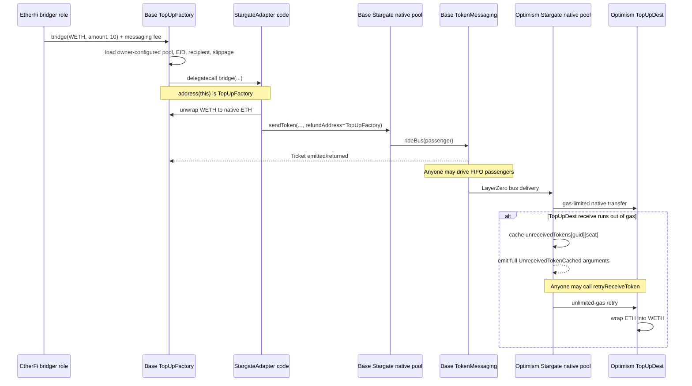

# Stargate V2 Bus / EtherFi `StargateAdapter` deep dive

## Executive result

No untrusted-user high- or medium-severity exploit was confirmed in the twelve proposed leads.

The most important result is a **real production delivery failure, but not a no-workaround freeze**. Five EtherFi Base-to-Optimism WETH top-ups, totaling **52.161845 ETH**, were still present in Stargate's `unreceivedTokens` cache at Optimism block `156,156,871` on 2026-08-28. They had remained there for approximately **130.57 to 142.21 days**. The initial native transfer to EtherFi's `TopUpDest` fails because Stargate deliberately gas-limits the first delivery while `TopUpDest.receive()` performs a WETH deposit.

However, Stargate's `retryReceiveToken()` is intentionally permissionless, all arguments are emitted in `UnreceivedTokenCached`, and a Safe owner or any keeper can call it directly. A fork test against one of the live entries succeeds from an arbitrary address and credits production `TopUpDest` with WETH. This completes the failed Stargate leg; the ordinary role-gated `TopUpDest.topUpUserSafe()` step is still needed to credit a particular Safe. Consequently, this is a **promising operational integration issue / Low or Informational severity**, not evidence of an EtherFi-specific missing Stargate recovery right.

| # | Lead | Classification | Result |
|---:|---|---|---|
| 1 | Bus ticket / `driveBus` lifecycle | **FALSE POSITIVE** | `driveBus` is permissionless; required passenger bytes are emitted and recoverable. |
| 2 | Destination receive failure / `unreceivedTokens` | **PROMISING** | Repeated production failures and five long-lived pending transfers exist, but public retry is a direct recovery path. |
| 3 | Route/peer/pool changes after send | **DESIGN / TRUST ASSUMPTION** | Stargate and LayerZero governance can affect delivery; no EtherFi-specific untrusted path was found. |
| 4 | Bus maximum wait | **LOW / INFO** | No on-chain deadline was found, but any caller can drive the FIFO queue. Live EtherFi samples completed quickly. |
| 5 | No cancellation after commitment | **DESIGN / TRUST ASSUMPTION** | This is Stargate's normal finality model; pending bus rides can be driven and failed receives retried. |
| 6 | Shared refund address | **LOW / INFO** | Refunds accrue to `TopUpFactory`, but every new call must still supply its quoted fee; no cross-user drain was found. |
| 7 | WETH/native balance mixing | **LOW / INFO** | Shared ETH and native dust can accumulate, but explicit value and role checks prevent an untrusted drain. |
| 8 | Exact quoted output used as minimum | **FALSE POSITIVE** | Current `FeeLibV1` uses the same view calculation for quote and execution in one transaction. |
| 9 | Caller-supplied fake Stargate pool | **FALSE POSITIVE** | The pool is owner-configured storage, not input controlled by an ordinary caller or the bridger. |
| 10 | ABI/version mismatch | **FALSE POSITIVE** | EtherFi's deployed tuple layouts, including `uint72 ticketId`, match Stargate V2. |
| 11 | Shared-decimal dust | **LOW / INFO** | Base WETH dust is below `10^12` wei per send and is refunded to the factory as native ETH. |
| 12 | Reentrancy/callback | **FALSE POSITIVE** | Canonical Stargate is non-reentrant; callback callers lack the factory bridger role. Fake components require owner misconfiguration. |

## Scope and sources

EtherFi code reviewed:

- `src/top-up/bridge/StargateAdapter.sol`
- `src/top-up/bridge/BridgeAdapterBase.sol`
- `src/top-up/TopUpFactory.sol`
- `src/top-up/TopUpDest.sol`
- `src/interfaces/IStargate.sol`
- `src/interfaces/IOFT.sol`
- Base and Optimism production fixtures/deployments in `deployments/mainnet`

Stargate was checked against official repository revision [`651bc0e4a034996493ee93f75a82b2326f9c7da8`](https://github.com/stargate-protocol/stargate-v2/tree/651bc0e4a034996493ee93f75a82b2326f9c7da8):

- [`StargateBase.sendToken`, failed-receive cache, and public retry](https://github.com/stargate-protocol/stargate-v2/blob/651bc0e4a034996493ee93f75a82b2326f9c7da8/packages/stg-evm-v2/src/StargateBase.sol#L248-L342)
- [`TokenMessaging.driveBus`](https://github.com/stargate-protocol/stargate-v2/blob/651bc0e4a034996493ee93f75a82b2326f9c7da8/packages/stg-evm-v2/src/messaging/TokenMessaging.sol#L185-L212)
- [`Bus` hash-chain and FIFO validation](https://github.com/stargate-protocol/stargate-v2/blob/651bc0e4a034996493ee93f75a82b2326f9c7da8/packages/stg-evm-v2/src/libs/Bus.sol#L81-L182)
- [`StargatePoolNative` limited initial outflow and unlimited retry](https://github.com/stargate-protocol/stargate-v2/blob/651bc0e4a034996493ee93f75a82b2326f9c7da8/packages/stg-evm-v2/src/StargatePoolNative.sol#L25-L65)
- [`Transfer` configurable gas limit](https://github.com/stargate-protocol/stargate-v2/blob/651bc0e4a034996493ee93f75a82b2326f9c7da8/packages/stg-evm-v2/src/libs/Transfer.sol#L12-L38)
- [`FeeLibV1.applyFee` delegates to `applyFeeView`](https://github.com/stargate-protocol/stargate-v2/blob/651bc0e4a034996493ee93f75a82b2326f9c7da8/packages/stg-evm-v2/src/feelibs/FeeLibV1.sol#L97-L120)

The live route checked was:

| Component | Chain | Address |
|---|---|---|
| EtherFi `TopUpFactory` | Base | [`0xF4e147...`](https://base.blockscout.com/address/0xF4e147Db314947fC1275a8CbB6Cde48c510cd8CF) |
| EtherFi `StargateAdapter` implementation | Base | [`0x51dD76...`](https://base.blockscout.com/address/0x51dD76A7081c7b84e410A77968a72EEeE1Caf4C3) |
| Stargate native pool | Base | [`0xdc181B...`](https://base.blockscout.com/address/0xdc181Bd607330aeeBEF6ea62e03e5e1Fb4B6F7C7) |
| Stargate `TokenMessaging` | Base | [`0x5634c4...`](https://base.blockscout.com/address/0x5634c4a5FEd09819E3c46D86A965Dd9447d86e47) |
| Stargate native pool | Optimism | [`0xe8CDF2...`](https://optimism.blockscout.com/address/0xe8CDF27AcD73a434D661C84887215F7598e7d0d3) |
| EtherFi `TopUpDest` | Optimism | [`0x3a6A72...`](https://optimism.blockscout.com/address/0x3a6A724595184dda4be69dB1Ce726F2Ac3D66B87) |

EtherFi's Base fixture configures canonical Base WETH, the Base native Stargate pool, 50 bps maximum slippage, and destination EID `30111` at `deployments/mainnet/fixtures/top-up-fixtures.json:299-304`. The deployed addresses are recorded at `deployments/mainnet/8453/deployments.json:4-5` and `deployments/mainnet/10/deployments.json:19`. Live `TopUpFactory.getTokenConfig(WETH, 10)` returned the same values during this review.

## Exact EtherFi and Stargate flow



EtherFi's important local lines are:

- `TopUpFactory.bridge()` is restricted to `TOPUP_FACTORY_BRIDGER_ROLE`, reads `TokenConfig` from storage, checks the balance and supplied fee, and delegatecalls the adapter (`TopUpFactory.sol:332-350`).
- Only the role-registry owner can set `bridgeAdapter`, destination recipient, slippage, and `additionalData` (`TopUpFactory.sol:303-320`).
- `StargateAdapter.bridge()` decodes the stored pool/EID, unwraps WETH, validates an ERC20 pool's token, calls `sendToken`, and emits the returned ticket (`StargateAdapter.sol:49-65`).
- The adapter selects Bus mode with a one-byte `oftCmd` and passes `address(this)` as refund recipient (`StargateAdapter.sol:81-94` and `63`). Because execution is a delegatecall, that address is `TopUpFactory`, not the deployed adapter implementation.
- `TopUpDest.receive()` executes `weth.deposit{value: msg.value}()` (`TopUpDest.sol:291-293`).
- Crediting pooled destination inventory to a specific Safe is a separate `TOP_UP_ROLE` operation (`TopUpDest.sol:160-223`).

## Lead 1 — Bus ticket lifecycle / `driveBus`

**Classification: FALSE POSITIVE**

`TokenMessaging.driveBus()` explicitly states and implements that **anyone** can drive all or part of a bus. It does not compare `msg.sender` with the passenger sender or ticket owner. The caller pays the LayerZero send fee and receives any LayerZero refund.

The returned `Ticket.passengerBytes` is sufficient only when the ticket is currently at the FIFO head. If earlier passengers are pending, the driver concatenates those earlier passengers first. This is not secret state: every ride emits `BusRode(dstEid, ticketId, fare, passenger)`. `Bus.checkTickets()` reconstructs and validates the hash chain from the current `nextTicketId`, and permits between one and `maxNumPassengers` passengers.

Therefore:

- EtherFi emitting its returned `Ticket` preserves its passenger data.
- Stargate independently emits the same passenger bytes in `BusRode`.
- A caller can recover preceding FIFO passengers from logs, quote `quoteDriveBus`, and call `driveBus` directly.
- No adapter storage or EtherFi wrapper is required.
- If Stargate's off-chain planner stops driving, an EtherFi user or independent keeper can drive the queue.

Twenty-one observed EtherFi Base WETH Bus tickets to Scroll were all matched to `BusDriven`; observed waits were approximately 14–318 seconds. This sample is evidence of operation, not a protocol liveness guarantee.

## Lead 2 — Destination receive failure / `unreceivedTokens`

**Classification: PROMISING operational issue; likely Low / Informational for Immunefi**

### Root cause and exceptional state

After source `sendToken()` succeeds, Stargate has already taken the native/ERC20 inflow, applied the fee, reduced path credit, and queued the bus passenger. On destination, `receiveTokenBus()` tries `_outflow(receiver, amount)`. If that call returns false, it stores:

```solidity
unreceivedTokens[guid][seatNumber] =
    keccak256(abi.encodePacked(srcEid, receiver, amountLD, ""));
```

and emits every value needed to retry.

This exceptional state occurs naturally for EtherFi's native route. The production Optimism native pool's initial transfer is gas-limited, while `TopUpDest.receive()` performs an external call to canonical WETH. The limited call fails and Stargate caches the transfer. `retryReceiveToken()` later validates the event-derived hash, deletes the cache entry, and calls the native pool's unlimited-gas `_safeOutflow`, allowing `TopUpDest` to wrap the ETH.

### Who can recover

`retryReceiveToken()` is external and has no sender/recipient/owner authorization check. Stargate documents in code that the message has already been delivered, so **anyone may retry**. Required arguments are exactly those emitted by `UnreceivedTokenCached`:

- `guid`
- seat/index
- source EID
- receiver
- local-decimal amount
- compose message (empty in Bus mode)

An EtherFi Safe owner does not need the Safe, `TopUpFactory`, an EtherFi backend, a Stargate planner, or a Stargate owner to originate the retry call. They can send it directly to the destination pool from any account. There is no claim/refund to the source chain; successful retry completes the original destination delivery into `TopUpDest`. It does not bypass EtherFi's normal `TOP_UP_ROLE` authorization for assigning shared destination inventory to a specific Safe.

### Production evidence

At Optimism block `156,156,871`, the following five cache hashes were nonzero. For each row, the Base source transaction emitted EtherFi `TopUpFactory.Bridge`, its passenger was included in the linked Base `BusDriven` GUID, and the linked Optimism transaction emitted `UnreceivedTokenCached` with receiver `TopUpDest`.

| Age on 2026-08-28 | Destination amount | GUID | EtherFi source bridge | Base bus drive | Optimism failed receive |
|---:|---:|---|---|---|---|
| 142.21 days | 9.519726 ETH | `0xb962f1...6e77` | [`0x35a9e4...`](https://base.blockscout.com/tx/0x35a9e44ae542191dc255a84e6d7f0323c14ad4262afa183dcc8c9d60c3b04fea) | [`0xa3919c...`](https://base.blockscout.com/tx/0xa3919c4124bcc178b26343a548e56e33e994900b2825d2174adfed6f6e9e3f44) | [`0x4d9818...`](https://optimism.blockscout.com/tx/0x4d98182f08a60088ebcbcaa90b330a12af652aad4580681ca722ddec7e43cb60) |
| 140.05 days | 6.678757 ETH | `0xcff3c0...02ee` | [`0xa5eb02...`](https://base.blockscout.com/tx/0xa5eb024b37ece3bc6a5dcf57946a6ca6af486f2941e75d71f1c6587ff338e0c4) | [`0x179ec2...`](https://base.blockscout.com/tx/0x179ec21cc0364b4f5448c921b3a0da12f1d9a37b830423ddd9b31aea7eff4a23) | [`0x10b0f5...`](https://optimism.blockscout.com/tx/0x10b0f570edd5f10d229529125b770e955a0d5989af80937850c4fc53d0a2c73a) |
| 135.51 days | 10.094915 ETH | `0x58fcb1...e003` | [`0x72c52f...`](https://base.blockscout.com/tx/0x72c52f40654796fc93145431075d01e7d9f412f27179e7957f9f035e6e60b2a3) | [`0x29d1e0...`](https://base.blockscout.com/tx/0x29d1e081faa999097f0e3db62dfe8a9058d83e109a98c3928a93b484298fcfd0) | [`0x19a1ad...`](https://optimism.blockscout.com/tx/0x19a1ad8619d136e019f25c0193bf295060a2f0656aa78fa1890adced11d44cc3) |
| 132.40 days | 12.466921 ETH | `0x562ef8...026c` | [`0x397efc...`](https://base.blockscout.com/tx/0x397efcbc98c04e102707e05b4a76eabcbab9abce355414670b7a66746645afa6) | [`0x6d91ce...`](https://base.blockscout.com/tx/0x6d91ceb2af78114e1f94c29deede26a4300e51b0cb7f47dc3ff9b56398435587) | [`0x98ec51...`](https://optimism.blockscout.com/tx/0x98ec51ecf0afe2bdbc2de9f7ab807d3e90177924e4a0fcdf3a8688422c471b36) |
| 130.57 days | 13.401526 ETH | `0xd17279...f2d3` | [`0x8b6b5e...`](https://base.blockscout.com/tx/0x8b6b5e048531104b1e19461f68c6cf631627f6c24d841d45b68d43c72c104e98) | [`0xf05399...`](https://base.blockscout.com/tx/0xf05399e6a55e1422ce67467f73137b952bf0580355216d32aebcd133fbd60b03) | [`0x892887...`](https://optimism.blockscout.com/tx/0x892887c3b3c0fac1a429bc454a43fe3563cccb2e6f92c20177dd4b6caecb25a7) |

Total: **52.161845 ETH**.

A sixth failure to the current `TopUpDest`, for 24.256836 ETH on 2026-04-22, was no longer cached at the pinned block. Historical Scroll scanning found 236 EtherFi-recipient failures; all had later retries. The longest observed retry delay was 550,110 seconds (approximately 6.37 days) for 15.091446 ETH: [failed receive](https://scroll.blockscout.com/tx/0x1e4cab6fba9fca41f6cda7bd919086742e35eace5e193803d0b16fc221c372e2), [retry](https://scroll.blockscout.com/tx/0x1b634e79db73f071ef8a03482d1d82a028445b655f92bfe3dee10ac0ac3db546). Most of those historical events targeted an older EtherFi receiver, so they establish Stargate retry behavior rather than current-recipient impact.

### Limits of the impact evidence

These source transactions are aggregate `TopUpFactory -> TopUpDest` inventory bridges, not one-to-one user withdrawal records. `TopUpDest` holds pooled WETH and `topUpUserSafe()` is separately called by EtherFi's `TOP_UP_ROLE`. It is therefore possible for a Safe to have been credited from existing destination inventory before its corresponding source liquidity batch arrived. The five pending cache entries prove that 52.161845 ETH of EtherFi-controlled replenishment had not reached `TopUpDest`; they do **not** by themselves prove that 52.161845 ETH of specific user balances remained inaccessible.

### Prerequisites, impact, and severity

- **Attacker prerequisite:** none; no attacker is needed. A destination receiver failure creates the state.
- **Have source funds left?** Yes. Source `sendToken()` and the LayerZero bus delivery are final before the destination pool caches the failed outflow.
- **Direct recovery path:** Yes for the failed Stargate leg. Any address can call `retryReceiveToken()` with public event arguments. The normal EtherFi role is still required to allocate shared `TopUpDest` inventory to a Safe.
- **Privileged intervention:** No Stargate or EtherFi privilege is needed for retry. Normal Safe crediting remains role-gated by design.
- **Realistic impact:** delayed replenishment of destination inventory until a user, EtherFi keeper, Stargate keeper, or third party notices and retries it; possible downstream top-up delay if destination float is insufficient.
- **Likely Immunefi severity:** Low/Informational. The observed entries exceed ten days, but the exceptional Stargate state has a direct public resolution and the transactions do not prove corresponding user Safes remained uncredited.

The five live entries show that neither EtherFi nor generic Stargate automation reliably sweeps every failed receive. That supports adding recovery automation, but it does not establish an inaccessible-user-funds impact.

### Fork PoC

The test is at `test/audit/StargatePendingTopUpRetryForkPoC.t.sol`. It uses no Stargate, `TopUpDest`, or WETH mocks. At the pinned production block it:

1. verifies the exact cache hash for the first row;
2. calls `retryReceiveToken()` as an unrelated `arbitraryKeeper` address;
3. verifies the cache is deleted; and
4. verifies production `TopUpDest` receives exactly 9.519726 WETH.

Run it with:

```bash
OPTIMISM_RPC=<rpc-url> forge test \
  --match-path test/audit/StargatePendingTopUpRetryForkPoC.t.sol \
  -vvv
```

Verified result during this review:

```text
[PASS] testFork_anyoneCanRetryRealPendingEtherFiTopUp()
1 passed; 0 failed
```

## Lead 3 — Route, peer, and pool changes after send

**Classification: DESIGN / TRUST ASSUMPTION**

There are two distinct configuration domains:

1. EtherFi's role-registry owner can replace the factory's adapter, destination recipient, slippage, pool, or EID. Those stored values affect future `TopUpFactory.bridge()` calls; they do not rewrite a passenger already committed to Stargate's queue.
2. Stargate/LayerZero owners and planners control peer, asset-ID, pathway, fee, fare, credit, and LayerZero security/executor configuration. Incorrect or malicious changes can pause or prevent transport.

No untrusted EtherFi user can make those changes. An already queued passenger remains in the old `TokenMessaging` FIFO and can be permissionlessly driven. A message already delivered into `unreceivedTokens` can be permissionlessly retried against the destination pool that cached it. If third-party governance permanently disables or corrupts that old infrastructure, recovery becomes dependent on Stargate/LayerZero governance, but that is the generic bridge trust model rather than an EtherFi lifecycle right that the adapter forgot to expose.

## Lead 4 — Bus maximum-wait guarantee

**Classification: LOW / INFO**

No user-enforceable timestamp, expiry, or maximum-wait variable exists in the reviewed Bus queue code. The queue stores a hash chain, `nextTicketId`, length, capacity, fares, and maximum passengers. Any advertised “maximum waiting time” is therefore an off-chain driver/planner service policy, not an on-chain deadline.

This does not trap the EtherFi user because `driveBus()` is permissionless and accepts a partial FIFO prefix. A user can recover the necessary bytes from `BusRode`, pay the LayerZero quote, and drive. Tickets do not expire. Configuration can make LayerZero transport unavailable, but that reduces to Lead 3.

Live observations also did not establish an unusually pending EtherFi bus ticket: the sampled 21 Base-to-Scroll WETH tickets all drove within 318 seconds, and the reviewed Base route queues were empty at the observation block.

## Lead 5 — No cancellation after source commitment

**Classification: DESIGN / TRUST ASSUMPTION**

`sendToken()` takes the source inflow and applies path accounting before queuing the Bus passenger. Stargate exposes no user cancellation that reverses this state. This is intentional: the lifecycle is “drive the committed passenger, then retry a failed destination outflow,” not “cancel and reclaim source assets.”

This differs materially from a request queue whose request can expire and whose normal user has a cancellation right. Here:

- a queued Bus ride can be driven by anyone;
- a delivered but failed outflow can be retried by anyone; and
- neither operation requires the original sender contract.

No EtherFi-specific missing cancellation wrapper was found.

## Lead 6 — Refund address is shared factory state

**Classification: LOW / INFO**

`StargateAdapter` passes `payable(address(this))` as `_refundAddress`. Because `TopUpFactory` invokes the adapter using `delegatecall`, the recipient is the shared **`TopUpFactory`**, not the adapter implementation.

For Bus mode, Stargate compares the supplied messaging fee with the current fare. If supplied fare is larger, `_rideBus()` sends the difference to `_refundAddress` with unrestricted gas. LayerZero taxi refunds are not relevant because EtherFi explicitly selects Bus mode. Native shared-decimal dust is also folded into the supplied fare and refunded to the factory as described in Lead 11.

The proposed cross-user theft does not work:

- `TopUpFactory.bridge()` requires `TOPUP_FACTORY_BRIDGER_ROLE`.
- It independently obtains the current quote and requires `msg.value >= bridgeFee` on every call.
- The adapter passes the explicit `valueToSend`; it does not ask Stargate to sweep `address(this).balance`.
- Pre-existing Factory ETH therefore cannot let a later caller submit zero fee, and an ordinary user cannot invoke the bridge path.

Excess `msg.value` beyond the factory's fee check is not returned by `TopUpFactory`, and protocol refunds are not attributed per transfer. This can leave operational ETH in the factory. The owner can recover native ETH through `recoverFunds(ETH, amount)` if the ETH sentinel is not a supported token; the reviewed production route configures WETH rather than the ETH sentinel. This is treasury/refund hygiene, not demonstrated user theft.

## Lead 7 — WETH/native accounting

**Classification: LOW / INFO**

For the production route, the factory holds WETH, `StargateAdapter` unwraps exactly `amount`, and the native pool receives `amount + messagingFee.nativeFee`. The balance check combines principal, fee, and old ETH, but the call value is explicit and each factory bridge must supply at least the quoted fee. Old ETH is not swept merely because it contributes to the aggregate balance.

One configuration edge case exists: WETH is unconditionally unwrapped before checking whether the configured pool is native. Configuring an ERC20 WETH Stargate pool would leave no WETH for `transferFrom` and make sends revert. The pool/EID are owner-managed, so this is a recoverable admin misconfiguration rather than an untrusted exploit.

The native shared-decimal remainder is returned as ETH to the factory, so repeated operations can convert sub-micro-ETH WETH dust into unattributed native balance. It cannot be consumed by an ordinary user through this path.

## Lead 8 — Exact `quoteOFT` output becomes `minAmountLD`

**Classification: FALSE POSITIVE for the current deployment**

EtherFi first checks the quoted `amountReceivedLD` against its configured slippage floor, then replaces `sendParam.minAmountLD` with the exact quote. This is stricter than merely retaining the user's floor.

In the reviewed deployment this does not create an exploitable quote/send race:

- `quoteOFT()` is a view call.
- The canonical native pool and WETH provide no attacker-controlled callback between quote and send.
- EVM transactions cannot be interleaved by another transaction.
- Current `FeeLibV1.applyFee()` is itself `view` and returns `applyFeeView()` using the same parameters.

If Stargate later installs a stateful fee library whose execution output differs from its quote, the strict minimum can make the bridge transaction revert. Revert restores the WETH unwrap and all Factory state, so the consequence is fail-closed availability rather than loss. Monitoring the configured fee-lib version is appropriate.

## Lead 9 — Fake Stargate pool

**Classification: FALSE POSITIVE for an untrusted caller; DESIGN / TRUST ASSUMPTION for admin configuration**

The adapter does decode `(stargatePool, destEid)` from `additionalData`, and a fake pool could imitate `token()`, quote methods, and `sendToken()`. In isolation, that would make the ERC20 approval dangerous.

The complete EtherFi path removes the attacker prerequisite:

- `additionalData` is written by `setTokenConfig()`, which is `onlyRoleRegistryOwner`.
- A bridger supplies only `token`, `amount`, and `destChainId`.
- `TopUpFactory.bridge()` loads the pool and EID from storage before the delegatecall.
- Calling the deployed adapter implementation directly does not execute in Factory context or grant access to Factory balances.

Thus an ordinary user cannot choose a fake pool. Owner compromise or owner misconfiguration could drain the factory through many simpler configurations as well and is outside the proposed untrusted-user attack.

## Lead 10 — Interface/version mismatch

**Classification: FALSE POSITIVE**

EtherFi's local ABI matches the reviewed Stargate V2 ABI for all used data:

- `Ticket(uint72 ticketId, bytes passengerBytes)`
- `SendParam(uint32,bytes32,uint256,uint256,bytes,bytes,bytes)`
- `MessagingFee(uint256,uint256)`
- `MessagingReceipt(bytes32,uint64,MessagingFee)`
- `OFTReceipt(uint256,uint256)`
- `sendToken()` returns `(MessagingReceipt,OFTReceipt,Ticket)`
- `quoteOFT()` and `quoteSend()` tuple layouts match.

No truncation or silent misdecode was found. In particular, EtherFi retained the nonstandard `uint72` ticket width, so future ticket growth does not create the suspected mismatch.

## Lead 11 — Cross-chain decimal normalization and dust

**Classification: LOW / INFO**

The production native pools use six shared decimals. Base WETH/native ETH uses 18 local decimals, producing a conversion rate of `10^12`. Stargate floors:

```text
amountSD = floor(amountLD / 10^12)
dedustedLD = amountSD * 10^12
dust = amountLD - dedustedLD
```

Maximum dust is therefore `10^12 - 1` wei, strictly less than `0.000001 ETH`, per bridge. A six-decimal token has no decimal-normalization dust; an eight-decimal token would leave fewer than 100 base units.

For an ERC20 pool, Stargate transfers only `dedustedLD`, leaving dust with the sender. For the native pool, EtherFi sends the original WETH amount as ETH; Stargate treats the excess over dedusted principal as extra messaging fee and `_rideBus()` refunds the difference to `TopUpFactory`. Thus the dust is not silently credited cross-chain or trapped in the pool. It becomes shared Factory ETH as discussed in Leads 6 and 7.

Splitting one transfer into many transfers can produce up to one remainder per send, but only the protocol bridger controls batching and every send incurs a cross-chain fee. No profitable user extraction path was found.

## Lead 12 — Reentrancy and callbacks

**Classification: FALSE POSITIVE for production configuration**

The genuine Stargate `sendToken()` is protected by `nonReentrantAndNotPaused`. Base WETH is canonical and has no transfer hook. On an ERC20 route, a callback from a malicious token/pool into `TopUpFactory.bridge()` would have `msg.sender` equal to that external contract and fail `TOPUP_FACTORY_BRIDGER_ROLE`.

A malicious owner-configured pool could call arbitrary Factory entry points during the delegatecall, but it already receives an approval or native call value and requires the trusted configuration failure described in Lead 9. No additional untrusted reentrancy escalation was identified.

## Recommendations

1. Add a destination-chain keeper that watches `UnreceivedTokenCached` where `receiver == TopUpDest` and calls `retryReceiveToken()` immediately.
2. Expose failed-delivery status and a “retry” action in the application. The transaction may be sent by any account; it does not need a Safe signature.
3. Document that native Stargate delivery to `TopUpDest` commonly follows a two-step `cache -> retry` lifecycle because `receive()` wraps WETH.
4. Emit or account for excess source `msg.value` and Stargate refunds in `TopUpFactory`, or explicitly sweep them to the recovery wallet.
5. Validate configured Stargate pools at configuration time against an allowlist and expected EID/token, even though current access control already makes the fake-pool lead non-exploitable by users.
6. Consider selecting a delivery mode/options that supplies enough initial destination gas, if Stargate supports doing so without materially increasing cost; otherwise treat retry automation as mandatory infrastructure.

## Final bounty assessment

The deep dive did not establish the target pattern “direct Stargate users have a recovery operation that EtherFi users cannot exercise.” Both relevant post-send actions are public:

- a queued Bus passenger can be driven by anyone; and
- a failed destination token delivery can be retried by anyone.

The live 52.161845 ETH cache is still important evidence of a monitoring/automation gap, but it also makes the distinction clear: the bridge leg is delayed, not permissionlessly irrecoverable, and the aggregate transfers do not prove user Safes were uncredited. A report claiming medium temporary freezing solely because the entries are older than ten days is likely to be invalidated.
