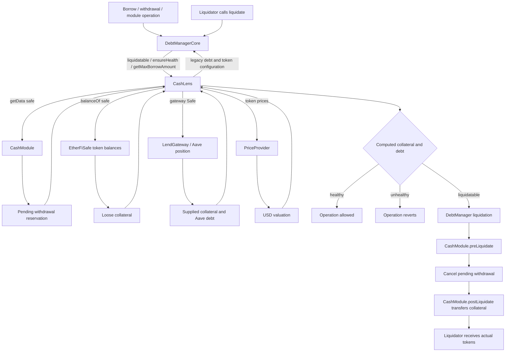
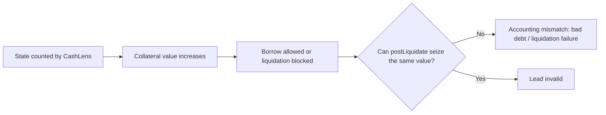

1. poti opri setarea unui nou owner consumand nonce-ul inainte ca currentowner sa fie apelat? gpt spune ca nu a gasit un flow, pare un lead mancat dar poate are ceva mai mult daca fac un deep dive in el fara gpt ❔✅
2. CashLens e folosit in operatiile de lichidare si altele, nu e un simplu user view. Posibil sa existe niste probleme legate de cross contract accounting? imi trebui ceva de genul `contract 1 -> CashLens -> contract 2`

   - 2.1 pot sa ma folosesc de un interestindex mai mic incercand sa fac frontrun la update-ul de config?
   - 2.2 pot sa ma folosesc de retrageri parrtiale pentru a folosi normalizarea de interest index la maxim?
   - 2.3 each _updateInterestIndex() commits the rounded result, so update frequency can influence cumulative rounding slightly.
   - 2.4 atunci cand calculez colateralul am posibil rounding pe fiecare token deci posibil ca roundingul sa se acumuleze, totusi cat de mult? poate e prea putin pentru a face o diferenta @note low lead
   - **2.5** pending > loose in calculate colateral asta + liquidate:

         Safe requests withdrawal of old liquidRESERVE
         → pending request records old token
         → legitimate batchRedeem burns Safe’s complete old-token balance
         → Safe receives the new token
         → pending old-token amount > old-token balance
         → processWithdrawal reverts

   - 2.6 pot sa am asseturi care ar trebui sa fie calculate la colateral balance in CashLens::_collateralBalances dar nu corespund cu asseturile listate de lendgateway? trebuie sa verific on chain daca se mapeaza asseturile astea intre ele
   - 2.7 pot modifica un safe sa fie out of lendgateway si sa beneficieze de tokenuri care nu sunt listate in mod normal pentru colateral

### Flow graph — CashLens as a solvency dependency



### Bug shape to search for



Main invariant: every unit of collateral returned through `CashLens` must exist exactly once and remain transferable through the liquidation path. Check loose balances, Aave-supplied balances, pending-withdrawal reservations, module custody, delisted assets and price-source differences.

3. Accounting shared intre safe-uri pentru acelasi modul. Daca un safe poate sa faca ceva rau intr-un modul toate celelalte pot fi afectate?
4. In CashModuleCore exista un preliquidate, pare ca blocheaza pending withdrawals in cazul in care o pozitie devine lichidabila, posibile buguri aici de value extraction 
5. In CashModuleCore::_spendCredit am un try and catch care presupune automat ca revertul e din cauza unui old withdrawl, pot sa am si alte cazuri?  oricum try and catch merita verificat
6. pot sa fac bypass la dailiy limit prin ceva replay de semnaturi sau scheme?
7. un lead bun, poti face spend credit in timpul opt out delay
8. poate cashbackul sa imi creasca liquidation thresholdul
9. any enabled EtherFi module that can be induced to make a user-controlled call could call the Spoke from the Safe. Because msg.sender would then be the Safe, Aave would authorize it automatically.
10. se intampla ceva intre request bridge si execute bridge in modulul de wormhole?
11. in data provider ce se intampla daca modific modulul/ il scot din whitelist
12. probleme la lichidare + tranzitie de la legacy la lendgateway?


## idea de asynchron operation + rounding intre finalizare si incepere similara ostium
| Priority | Async flow | Conversion | Main state-gap concern |
|---|---|---|---|
| High | Midas redemption | Midas shares → output asset | No local `minReturn`, deadline, request ID, or completion tracking |
| Medium | Across/Enso delayed swaps | Source token → destination token | Quote/calldata becomes stale while other operations can alter balances and Aave health |
| Medium | Stargate/OFT bridging | Local decimals → shared decimals | Dust truncation and slippage rounding can leave residual tokens |
| Medium | Pending cashback | Stored USD → token at future price | Floor rounding can turn small pending cashback into zero and delete it |
| Low | Lend opt-out | Aave supplied shares → assets | Uses live balances, but borrowing during the delay can block completion |
| Low | Cash delayed withdrawal | Aave shares → exact loose token amount | Conversion happens when requested, not when completed |

## wormhole bridge
1. Source transfer succeeds:
   Safe tokens leave source chain
   ↓
   privileged NTT config change makes message permanently/non-temporarily
   unredeemable on destination
   ↓
   is there an NTT-standard recovery/refund path?

2. Transfer is inbound queued:
   ↓
   Wormhole exposes completeInboundQueuedTransfer(...)
   or equivalent
   ↓
   can the EtherFi Safe owner / anyone call it directly?

---

# Expanded and prioritized leads

These are hypotheses, not findings. Promote one only after proving a path without assuming a malicious EtherFi/Aave/Veda administrator.

| Priority | Lead | Current assessment | Required proof |
|---|---|---|---|
| High | CashLens/liquidation mismatch | Security-critical dependency | Collateral counted for solvency but unavailable, stale, or counted twice |
| High | Migration with pending state | Strong transition surface | Reconcile all legacy debt/collateral with Aave debt, supply, and loose reservations |
| High | User-controlled Safe call to Aave Spoke | Dangerous primitive; no concrete caller | Enabled module must let input control the Safe call target |
| High | Async request plus mutable global config | Proven bug class | Current config changes authority, custody, or destination of an old request |
| Medium | Wormhole request/execute drift | Good async lead | Change NTT config after request and show material custody/liveness impact |
| Medium | Broad legacy-credit catch | Suspicious, usually atomic | First call fails, cancellation changes cause, retry succeeds |
| Low | Recovery nonce griefing | No repeatable permissionless path found | Reusable authorization or immediate irreproducible harm |

## 1. Recovery nonce versus owner transition

Inspect `RecoveryManager`, `cancelNonce`, module calls to `useNonce()`, and `_currentOwner()`. Invalidating one recovery signature is normally only a delay. Continue only if a reverted/public signature remains reusable, nonce consumption can be repeated without fresh quorum, a module catches failure after consuming the nonce, or recovery depends on an external opportunity that cannot be recreated.

## 2. CashLens is inside the solvency boundary

```text
DebtManager.liquidatable/getMaxBorrowAmount/collateralOf
  -> CashLens.getUserTotalCollateral
  -> CashModule state + Safe balances + external positions
```

Test that:

1. every collateral unit is transferable by `postLiquidate`;
2. nothing is counted both loose and supplied;
3. pending withdrawals are subtracted exactly once;
4. module-custodied assets are not still counted for the Safe;
5. pending cashback is excluded until paid;
6. delisted collateral cannot remain valued but unseizable; and
7. legacy/gateway branches cannot disagree during migration.

Best sequence: create a module withdrawal, move price until liquidatable, let `preLiquidate` cancel the reservation, then compare quoted collateral with what liquidation can actually transfer.

## 3. Shared accounting between Safes

Request mappings are mostly per-Safe, but module balances, allowances, reserve capacity, and configuration are shared. Check whether Safe A can leave tokens, approval, request IDs, or external state consumed by Safe B. `WormholeModule._bridge()` checks aggregate module balance, but normally receives the exact Safe withdrawal immediately before bridging atomically; seek real residual custody, not donated dust without victim loss.

## 4. `preLiquidate` versus async requests

Cancellation before liquidation is intentional. The useful questions are whether a user-created module callback can permanently revert and block liquidation, callback ordering deletes only one side, external async state already exists, or cancellation makes Lens treat externally committed assets as available.

## 5. Broad catch in legacy credit spend

`_spendLegacyCredit` catches every first borrow revert, cancels withdrawal, and retries. If retry fails, all state—including cancellation—rolls back. A viable path needs the first call to fail for a condition changed by cancellation, the retry to succeed, and cancellation to irreversibly harm an external module request. Generic pause/liquidity failures are dead ends.

## 6. Spending-limit bypass

Direct replay is blocked by `transactionCleared[safe][txId]`. Better variants:

1. one economic payment under two distinct `txId` values;
2. timezone/day-boundary double reset;
3. Lens and execution selecting different pending limits;
4. sponsor-specific settlement deduplication versus Safe-global limits;
5. backend-provided USD amount understating token value; or
6. cross-module callback changing mode/pending state during settlement.

## 7. Credit spending during opt-out

Credit before maturity appears intentional. At maturity, effective opt-out should reject new gateway borrowing even if existing debt prevents unwind. Test exact `finalizeTime`, every borrow entry point, and Enso/OpenOcean/Across while opt-out is matured but collateral remains supplied. High impact requires borrowing after effective opt-out, not immediately before it.

## 8. Cashback and liquidation

Pending cashback is not collateral. More promising variants are: dispatcher reports paid without actual balance increase; rounding pays zero and deletes a positive claim; duplicate entries exceed the intended aggregate percentage; Lens counts before delivery; or cashback sent elsewhere is valued on the Safe.

## 9. Enabled module causing Safe -> Aave Spoke calls

The primitive is dangerous because the Spoke trusts the Safe caller. Current modules mostly use fixed targets: OpenOcean router, Enso router, Across SpokePool/periphery, fixed ERC20 recovery calls, and internally built lending calls. If a router calls Aave, Aave sees the router—not the Safe—unless execution uses delegatecall in Safe context.

Continue searching for user-controlled `target`, forwarded call arrays, delegatecall/fallback handlers, user-selected callbacks, or a globally whitelisted generic module.


## 10. Wormhole request/execute gap

1. Execution rereads current `assetConfig`; an NTT manager update can change target after signing.
2. Live fee is not signed—mostly liveness because executor pays.
3. Original signed amount is rounded before local/Cash storage.
4. Cash request replacement deletes local Wormhole state.
5. Simple NTT-revert custody is invalid because withdrawal and bridge are atomic.
6. After source success, local state is deleted: inspect destination queue completion/refund rights and rate limits.
7. Test whether messages remain redeemable after peer/transceiver configuration changes.

## 11. Mutable configuration during pending requests

| Change | Potential consequence |
|---|---|
| Remove global module whitelist | Module loses Safe execution authority |
| Remove Cash withdrawal whitelist | Old request provenance may be reinterpreted |
| Change router/manager | Execution target differs from request time |
| Delist token/reserve | Pending cancel/process/liquidation may fail |
| Change hook/default module | Execution policy changes mid-request |

Prioritize untrusted authority gain or irreversible movement, not avoidable unsafe-admin DoS.

## 12. Liquidation and migration

Migration is atomic, so basic half-migration theories revert. Test:

1. legacy debt value before equals Aave debt after within bounded rounding;
2. collateral is supplied or intentionally loose for a withdrawal;
3. reserved loose collateral gives no Aave borrowing power;
4. no legacy debt remains after engine flip;
5. all debt/collateral tokens exist in gateway reserves;
6. clear/reborrow rounding cannot create bad debt or excess user debt; and
7. pending withdrawals remain executable afterward.

Strong scenario A: reserve collateral in a withdrawal, migrate only unreserved collateral, recreate debt, flip engine, then execute withdrawal. Verify migration headroom uses only collateral actually supplied to Aave.

Strong scenario B: a Safe liquidatable under legacy thresholds migrates into a healthy Aave position, disabling legacy liquidation. There is no initial `ensureHealth` in migration. It matters only if routine trusted migration violates policy or causes economic loss.

## New adjacent leads

1. **Borrow then best-effort resupply:** test frozen/capped/isolated and fee-on-transfer assets; compare nominal and actual supplied amounts.
2. **Best-effort swap resupply:** with no debt, output may remain loose; compare Lens, opt-out, and later migration assumptions.
3. **Non-standard tokens:** inspect requested versus actual deltas in gateway, bridges, settlement, and liquidation.
4. **Exact timestamps:** compare mode, opt-out, withdrawal, deadline, and spending-limit state at the exact second.

## Recommended order

1. Migration with pending withdrawal.
2. Legacy-liquidatable Safe migration into Aave.
3. CashLens inventory versus transferable liquidation balances.
