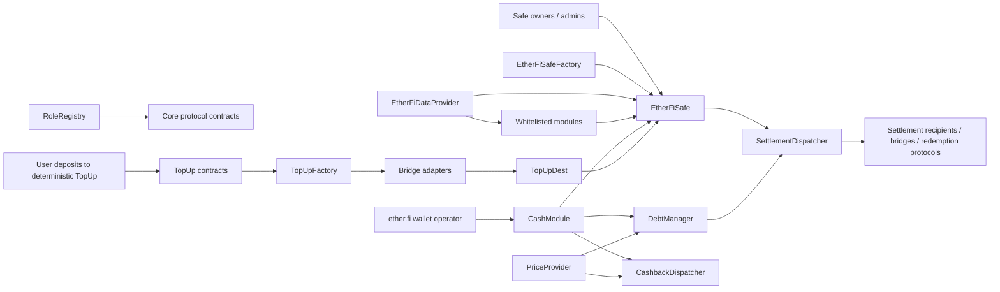

# ether.fi Cash v3 — Protocol, Flows, Entry Points, and Integrations

## Scope and reading notes

This document describes the contracts under `src/` in this repository. It is a code-level architecture map, not a statement that every contract or integration is active on every deployed chain. The deployment JSON and current on-chain configuration must be checked to determine which implementation, module, token, oracle, bridge adapter, and role holder is live on a particular chain.

## What the protocol does

ether.fi Cash is a smart-account-based crypto banking and card-settlement system. Each user owns an `EtherFiSafe`, which holds the user's assets. Approved modules can make narrowly defined calls from that Safe after satisfying the relevant owner/admin signatures, delays, limits, and protocol roles.

The system supports:

- self-custodial, threshold-controlled smart accounts;
- debit card spending from assets held in the user's Safe;
- collateralized credit spending from protocol-funded liquidity;
- suppliers who provide borrow-token liquidity and earn the configured interest;
- debt repayment and permissionless liquidation of unhealthy accounts;
- token cashback, including deferred cashback when the dispatcher lacks liquidity;
- delayed user withdrawals and delayed changes to spending mode/limits;
- settlement of card-spend funds locally or across chains;
- deterministic per-user deposit/top-up addresses and destination-chain payouts;
- Safe recovery, module management, and owner/admin management;
- swaps, bridging, staking, lending, and yield-product access through optional Safe modules;
- separate trading accounts linked to a source EtherFi Safe.

The important distinction is between asset custody and execution authority: assets normally remain in a user's Safe, but an enabled module can instruct the Safe to execute calls through `execTransactionFromModule`. Security therefore depends on the Safe owners, enabled modules, module-level signatures, protocol roles, delays, oracle configuration, and upgrade authority.

## High-level architecture

## Core contracts

| Component | Responsibility |
|---|---|
| `EtherFiSafe` / `EtherFiSafeCore` | User smart account. Stores owners, threshold, admins, recovery state, and enabled modules. Executes batches requested by enabled modules. |
| `EtherFiSafeFactory` | Deterministically deploys BeaconProxy-based Safes and records which addresses are valid EtherFi Safes. |
| `ModuleManager` | Enables/disables modules with owner-threshold authorization and checks the global module allowlist. |
| `MultiSig` | Owner set, signing threshold, nonce, and signature verification. |
| `RecoveryManager` | Configurable recovery signers, threshold, delayed owner replacement, cancellation, and protocol/third-party recovery signers. |
| `EtherFiDataProvider` | Shared address book and global module policy: Safe factory, Cash module/lens, price provider, hook, recovery signers, refund wallet, and default/allowed modules. |
| `RoleRegistry` | Global owner and enumerable operational roles, plus per-Safe admin roles. Also gates upgrades, pausing, and protocol operators. |
| `CashModuleCore` + `CashModuleSetters` | Card spend, debit/credit mode, spending limits, delayed withdrawals, repayments, cashback orchestration, and liquidation callbacks. Setter logic is reached through `CashModuleCore` fallback/delegatecall. |
| `DebtManagerCore` + `DebtManagerAdmin` | Internal lending pool, supplier shares, borrow interest, collateral valuation, health checks, borrow/repay, and liquidation. Admin logic is reached through the core fallback/delegatecall. |
| `PriceProvider` / `PriceProviderV2` | Normalizes configured oracle responses to 6-decimal USD prices, checks staleness for Chainlink-type feeds, supports stable-token bounds and base-asset conversion. |
| `SettlementDispatcherV2` | Receives card-spend assets and routes them to settlement recipients, L1, another chain, a refund wallet, or redemption queues. |
| `CashbackDispatcher` | Holds reward-token inventory, converts USD rewards to tokens, pays available cashback, and supports later claims of unpaid cashback. |
| `CashLens` | Read-only spendability, account, collateral, withdrawal, debt, and max-spend calculations. |
| `TopUp` / `TopUpFactory` / `TopUpDest` | Deterministic deposit addresses, collection on source chains, configurable bridging, and idempotent payout to the user's Safe on a destination chain. |
| `TradingSafe` / `TradingSafeFactory` / `TradingLens` | Separate Safe linked to a source Safe for trading assets, deterministic TopUp association, asset reporting, and redirection between trading and top-up accounts. |
| `AssetRecoveryModule` / `SafeAssetRecoveryModule` | Signature-authorized emergency recovery paths, including LayerZero-based recovery dispatch and constrained local Safe sweeps. |

## Main protocol flows

### 1. Safe creation and configuration

1. A caller invokes `EtherFiSafeFactory.deployEtherFiSafe` with a salt, owners, threshold, initial modules, and module setup data.
2. The factory deploys a deterministic BeaconProxy and initializes it.
3. `EtherFiSafeCore.initialize` configures multisig owners, recovery state, modules, and Safe-admin roles.
4. Owners later authorize owner, threshold, admin, module, recovery, and nonce changes with threshold signatures.
5. Enabled modules call `EtherFiSafe.execTransactionFromModule`; the Safe verifies the module remains enabled and globally allowed, invokes optional pre/post hooks, and performs the requested calls.

### 2. Debit card spend

1. The ether.fi wallet backend, holding `ETHER_FI_WALLET_ROLE`, calls `CashModuleCore.spend` with a unique transaction ID, BIN sponsor, settlement tokens, USD amounts, and cashback instructions.
2. The Cash module resolves any delayed mode change, rejects replayed transaction IDs, and consumes daily/monthly spending capacity.
3. In debit mode, it converts each USD amount into token units through `DebtManager`/`PriceProvider`, checks the Safe balance, and reduces or cancels conflicting pending withdrawals.
4. The Cash module instructs the Safe to transfer the tokens to the settlement dispatcher selected for the BIN sponsor.
5. It verifies the account remains healthy after the transfer. If an existing pending withdrawal causes the health check to fail, that withdrawal is cancelled and health is checked again.
6. Cashback is attempted through `CashbackDispatcher`; unpaid USD-denominated rewards are recorded for later retrieval.

### 3. Credit card spend

1. The same `spend` entry point is used while the Safe is in credit mode.
2. Credit mode accepts one supported borrow token per spend.
3. `CashModule` instructs the Safe to call `DebtManager.borrow`.
4. `DebtManager` accrues interest, increases the Safe's normalized debt, values collateral held directly by the Safe, and enforces LTV/health limits.
5. The borrowed token is sent from `DebtManager` liquidity directly to the selected settlement dispatcher; it does not first enter the user's Safe.
6. The unique transaction ID and spending limits prevent duplicate or excess settlement.

### 4. Liquidity supply, repayment, and liquidation

- Any non-Safe liquidity provider can call `DebtManager.supply(user, token, amount)`. The designated `user` receives pool shares; EtherFi Safes cannot be suppliers.
- A supplier calls `withdrawBorrowToken` to burn enough shares and withdraw available underlying liquidity.
- The wallet operator calls `CashModule.repay`; the Safe approves and transfers the borrow token to `DebtManager`, which reduces normalized debt.
- Anyone can call `DebtManager.repay(user, token, amount)` to repay a Safe's debt using the caller's tokens.
- Anyone can call `DebtManager.liquidate` for an unhealthy Safe. The liquidator supplies the borrow token; `CashModule.preLiquidate` clears pending withdrawals/bridge requests as needed, and `postLiquidate` transfers selected collateral plus the configured bonus from the Safe to the liquidator. The implementation first targets half the debt and then the remainder if the account is still unhealthy.

### 5. User withdrawal and account-setting delays

1. Owners authorize `CashModuleSetters.requestWithdrawal` with threshold signatures. Approved modules may use `requestWithdrawalByModule` for their own operation.
2. The request records tokens, amounts, recipient, and a finalization time.
3. After the withdrawal delay, anyone may call `CashModuleCore.processWithdrawal`; the Safe transfers the requested assets if balances and account health permit it.
4. Owners can cancel a user withdrawal, while the originating module can cancel its module withdrawal.
5. Switching debit/credit mode and increasing spending limits use configured delays. This gives the card/liquidation system time to react before assets or risk parameters become effective.

### 6. Settlement

Funds accumulated in `SettlementDispatcherV2` can be handled by a holder of `SETTLEMENT_DISPATCHER_BRIDGER_ROLE`:

- `settle` transfers a token to its configured same-chain recipient;
- `bridge` selects configured Stargate/OFT, Circle CCTP, or OP Stack canonical-bridge handling;
- `withdrawLiquidAsset` requests redemption through a configured Boring on-chain queue;
- `redeemFraxToUsdc` or `redeemFraxAsync` uses Frax's custodian or RemoteHop;
- `redeemMidasToAsset` submits a Midas redemption request;
- `transferFundsToRefundWallet` sends assets to the configured refund wallet.

The role-registry owner can configure destinations and rescue funds. Therefore settlement is operationally permissioned even though card funds originate from user Safes or the lending pool.

### 7. Cashback

1. `CashModule.spend` includes one or more reward instructions and invokes `CashbackDispatcher.cashback`.
2. The dispatcher converts the 6-decimal USD amount using `PriceProvider` and pays from its token inventory.
3. A failed or underfunded payment is recorded in `CashModule` as pending USD cashback.
4. `clearPendingCashback` is permissionless and retries payment later.

### 8. Cross-chain top-up

1. `TopUpFactory.deployTopUpContract` creates a deterministic per-user/per-purpose TopUp address.
2. A user or third party sends ETH or configured ERC-20s to that address. ETH is wrapped to WETH on receipt.
3. Permissionless `TopUpFactory.processTopUp` causes each TopUp to transfer its full selected-token balance to the factory.
4. An authorized bridger calls `TopUpFactory.bridge`; the factory delegatecalls the bridge adapter configured for `(token, destinationChainId)`.
5. Liquidity is delivered to the destination-side `TopUpDest` or configured recipient.
6. An authorized top-up operator calls `TopUpDest.topUpUserSafe` or its batch form. A transaction ID derived from source transaction/user/token prevents duplicate payout.
7. `TopUpDest` transfers the token (or unwraps WETH and sends native ETH) to the user's destination Safe.

The adapter set includes Stargate, Circle CCTP, Wormhole NTT, OP Stack, Scroll, EtherFi OFT/Liquid, Hop, and a Base withdrawal adapter. Configuration determines which one is actually used for each route.

### 9. Optional Safe-module operations

Most asset modules follow this pattern: a Safe admin or owner quorum signs parameters bound to the chain, module, Safe, and nonce; the module checks available balance (excluding pending Cash withdrawals where applicable); then it calls the external protocol through `EtherFiSafe.execTransactionFromModule`.

- Aave V3: supply, variable-rate borrow, withdraw, repay, and claim incentives.
- EtherFi staking: convert ETH/WETH to weETH through the L2 Sync Pool.
- EtherFi Liquid: deposit into configured Teller/vault products, request queue withdrawals, and bridge Liquid assets through the Teller's LayerZero support.
- Frax: synchronous FraxUSD mint/redeem through the custodian or asynchronous withdrawal through RemoteHop/LayerZero.
- Midas: instant vault deposit and asynchronous redemption request.
- beHYPE: stake WHYPE and receive beHYPE asynchronously through a LayerZero OApp staker.
- OpenOcean: signed same-chain token/native swaps with a minimum output.
- Enso: signed same-chain or cross-chain swap intent using backend-built Enso router calldata; execution can be permissionless after a Cash withdrawal hold matures.
- Across: signed same-chain/cross-chain swap and bridge intents through Across SpokePool/periphery/multicall handling.
- Stargate and Wormhole: delayed/requested cross-chain withdrawals with owner signatures, cancellation, fee quoting, and permissionless execution of the stored request.

## Important external entry points

The list below focuses on state-changing integration surfaces. Initializers and routine getters are omitted unless architecturally important.

### Safe and account management

| Contract | Entry points | Caller / authorization |
|---|---|---|
| `EtherFiSafeFactory` | `deployEtherFiSafe` | Permissionless while unpaused. |
| `EtherFiSafeCore` | `configureAdmins`, `cancelNonce` | Safe owner-threshold signatures. |
| `MultiSig` | `configureOwners`, `setThreshold` | Safe owner-threshold signatures. |
| `ModuleManager` | `configureModules` | Owner-threshold signatures; module must be globally allowed. |
| `RecoveryManager` | `setUserRecoverySigners`, `setRecoveryThreshold`, `toggleRecoveryEnabled`, `overrideRecoverySigners`, `recoverSafe`, `cancelRecovery` | Owner or recovery-signature rules plus recovery delay. |
| `EtherFiSafeCore` | `execTransactionFromModule`, `useNonce` | Enabled/allowed module only. |

### Cash, credit, and settlement

| Contract | Entry points | Caller / authorization |
|---|---|---|
| `CashModuleCore` | `spend`, `repay` | `ETHER_FI_WALLET_ROLE`, for a registered Safe. |
| `CashModuleSetters` via Cash core | `setMode`, `updateSpendingLimit` | Safe admin signature; delayed when risk increases. |
| `CashModuleSetters` via Cash core | `requestWithdrawal`, `cancelWithdrawal` | Safe owner-threshold signatures. |
| `CashModuleSetters` via Cash core | `requestWithdrawalByModule`, `cancelWithdrawalByModule` | Approved withdrawal module. |
| `CashModuleCore` | `processWithdrawal`, `clearPendingCashback` | Permissionless once eligible. |
| `DebtManagerCore` | `supply`, `withdrawBorrowToken`, `repay`, `liquidate` | Permissionless subject to balances/health; `borrow` is Safe-only. |
| `CashbackDispatcher` | `cashback`, `clearPendingCashback` | Cash module only in normal operation. |
| `SettlementDispatcherV2` | `settle`, `bridge`, redemption/refund functions | Settlement bridger role. |

### Top-up and trading

| Contract | Entry points | Caller / authorization |
|---|---|---|
| `TopUpFactory` | `deployTopUpContract`, `processTopUp`, `processTopUpFromContracts` | Permissionless. |
| `TopUpFactory` | `bridge` | Top-up bridger role. |
| `TopUpDest` | `deposit` | Depositor role. |
| `TopUpDest` | `topUpUserSafe`, `topUpUserSafeBatch` | Top-up operator role. |
| `TradingSafeFactory` | `deployTradingSafe` | `TRADING_SAFE_FACTORY_ADMIN_ROLE`; deployment is deterministic from the supplied source Safe. |
| `TradingSafeFactory` / `TradingSafe` | `redirectToTopUp` | `TRADING_SAFE_REDIRECT_ROLE`, a factory-deployed TradingSafe, and supported-token checks. |

### Optional asset modules

| Module | Main entry points |
|---|---|
| `AaveV3Module` | `supply`, `borrow`, `withdraw`, `repay`, `claimRewards`, `claimAllRewards` |
| `EtherFiStakeModule` | `deposit` |
| `EtherFiLiquidModule` | `deposit`, `withdraw`, `requestBridge`, `executeBridge`, `cancelBridge` |
| `FraxModule` | `deposit`, `withdraw`, `requestAsyncWithdraw`, `executeAsyncWithdraw`, `cancelAsyncWithdraw` |
| `MidasModule` | `deposit`, `withdraw` |
| `BeHYPEStakeModule` | `stake` |
| `OpenOceanSwapModule` | `swap` |
| `EnsoSwapModule` | `requestSwap`, `executeSwap`, `cancelSwap`, `cancelExpiredSwap` |
| `AcrossSwapModule` | `requestSwap`, `executeSwap`, `cancelSwap`, `cancelExpiredSwap` |
| `StargateModule` | `requestBridge`, `executeBridge`, `cancelBridge` |
| `WormholeModule` | `requestBridge`, `executeBridge`, `cancelBridge` |
| Recovery modules | `recover` |

## External protocols and infrastructure

| External system | Where used | Interaction |
|---|---|---|
| Aave V3 | `AaveV3Module` | Pool supply/borrow/withdraw/repay, wrapped-token gateway for ETH, and incentives claims. This is separate from EtherFi Cash's own `DebtManager`. |
| Chainlink-compatible and generic oracles | `PriceProvider`, `PriceProviderV2` | `latestRoundData`-style feeds with staleness checks, plus configurable static calls for non-standard oracle contracts. Deployment config may point the generic path at providers such as Pyth adapters; the Solidity does not hard-code Pyth. |
| EtherFi L2 Sync Pool / weETH | `EtherFiStakeModule` | Stakes ETH/WETH and receives weETH. |
| EtherFi Liquid / Teller and Boring queues | `EtherFiLiquidModule`, `LiquidUSDLiquifierOP`, `SettlementDispatcherV2` | Deposit/mint Liquid assets, request redemptions through Boring on-chain queues, and bridge through Teller/LayerZero. |
| Stargate / LayerZero OFT | `StargateModule`, `SettlementDispatcherV2`, `StargateAdapter`, `EtherFiOFTBridgeAdapter` | Token/OFT bridging, fee quotes, LayerZero endpoint IDs, and Stargate “ride bus” sends. |
| LayerZero messaging | EtherFi Liquid, Frax, beHYPE, recovery, Stargate/OFT paths | Cross-chain sends, asynchronous redemption/staking, and recovery dispatch. |
| Circle CCTP v2 | `CCTPAdapter`, `SettlementDispatcherV2` | Burns/mints USDC cross-chain through `TokenMessenger`, with domain/finality/fee configuration. |
| Wormhole Native Token Transfers (NTT) | `WormholeModule`, `NTTAdapter` | Token transfer through an NTT manager with fee quoting and dust handling. |
| Across | `AcrossSwapModule` | `SpokePool.depositV3`-style bridging and optional origin/destination swap execution through configured periphery/multicall contracts. |
| Enso | `EnsoSwapModule` | Forwards user-signed, backend-generated route/bundle calldata to a pinned Enso Router. |
| OpenOcean | `OpenOceanSwapModule` | Same-chain router swaps with calldata validation and minimum-return checks. |
| Frax | `FraxModule`, `SettlementDispatcherV2` | FraxUSD custodian deposit/redeem and RemoteHop asynchronous cross-chain redemption. |
| Midas | `MidasModule`, `SettlementDispatcherV2` | Instant deposit into Midas vault products and asynchronous redemption requests. |
| Hyperliquid ecosystem beHYPE | `BeHYPEStakeModule` | Stakes WHYPE through the beHYPE OApp staker; beHYPE arrives asynchronously. |
| OP Stack canonical bridges | `OptimismBridgeAdapter`, `SettlementDispatcherV2` | L1 deposits and L2 withdrawals for ERC-20/native ETH; suitable for Optimism/Superchain-style deployments when configured. |
| Scroll canonical ERC-20 bridge | `ScrollERC20BridgeAdapter` | Resolves Scroll gateway/messenger and pays the message queue fee for L1-to-Scroll transfer. |
| Hop-style bridges | `HopBridgeAdapter` | Calls a configured Hop v2 route for top-up transfers. |
| Wrapped native tokens | Top-up, Aave, and staking paths | WETH/chain-native wrappers normalize native asset handling. |

OpenZeppelin upgradeability, token, cryptography, math, and access-control libraries are implementation dependencies rather than external liquidity or settlement protocols.

## Trust boundaries and operational assumptions

- Safe owners control owner/module/recovery changes through signatures, but globally allowed modules and default modules are controlled through protocol governance roles.
- Enabled modules are powerful: the Safe executes arbitrary target/data arrays supplied by them. Module allowlisting, implementation upgrades, and immutable/configured external targets are critical trust boundaries.
- The ether.fi wallet role initiates card spend and repayment using off-chain transaction information. On-chain replay protection is the `txId`; on-chain amounts, limits, balances, and health checks constrain it.
- Oracle administrators choose token feeds and generic oracle calldata. Incorrect, stale-permitted, or malicious oracle configuration directly affects borrowing, liquidation, spend conversion, and cashback.
- Liquidity providers bear utilization, bad-debt, oracle, liquidation, and upgrade risk in the internal `DebtManager` pool.
- Settlement and destination top-up completion require authorized operators. Idempotency prevents duplicate top-ups, but the contracts do not make the off-chain source-transaction judgment themselves.
- Most core contracts are UUPS proxies; Safes, TopUps, and TradingSafes use upgradeable beacons. Role-registry ownership/upgrader authority can therefore change implementation behavior.
- Bridge, swap, vault, and staking modules add the external protocol's own smart-contract, liquidity, relayer, message-delivery, slippage, and finality risks.
- Pending withdrawal/bridge state is coupled to card collateral safety. Bridge-capable modules expose `cancelBridgeByCashModule` so Cash liquidation or withdrawal cancellation can release reserved state.

## Source map

- Safe/account: `src/safe/`, `src/beacon-factory/`
- Cash/card: `src/modules/cash/`, `src/cashback-dispatcher/`
- Credit/liquidity: `src/debt-manager/`
- Settlement: `src/settlement-dispatcher/`
- Top-up: `src/top-up/`
- Trading account: `src/trading-safe/`
- Optional integrations: `src/modules/`, `src/across/`, `src/enso/`
- Oracle and global configuration: `src/oracle/`, `src/data-provider/`, `src/role-registry/`
- Deployment-specific addresses/configuration: `deployments/` and deployment script outputs
