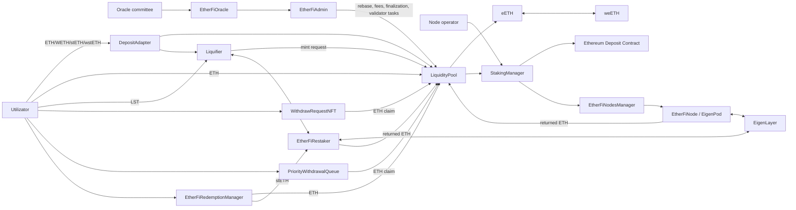
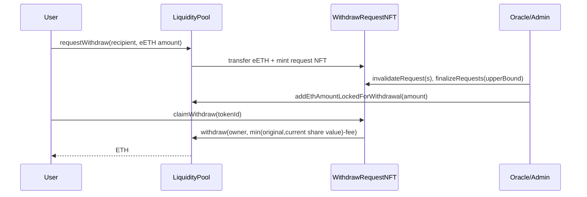
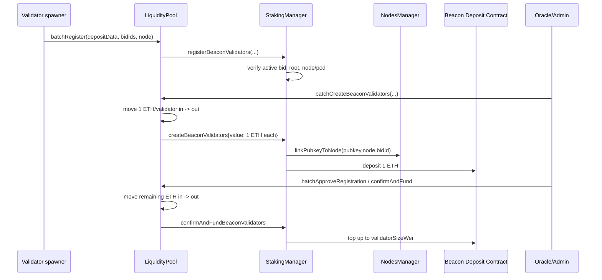

# Ether.fi Liquid Restaking Protocol — arhitectură, flow-uri și entrypoint-uri

> Document orientat pentru code review și threat modeling. Este derivat din implementările curente din `src/`; contractele din `src/archive/` sunt tratate ca legacy.

## 1. Ce face protocolul

Ether.fi primește ETH sau active de liquid staking, emite tokenul rebasing `eETH`, permite împachetarea lui în tokenul non-rebasing `weETH`, folosește capitalul pentru validatori Ethereum și restaking în EigenLayer și oferă mai multe căi de retragere.

Flow-ul economic, simplificat:

1. Utilizatorul depune ETH direct sau LST-uri prin `Liquifier`/`DepositAdapter`.
2. `LiquidityPool` contabilizează valoarea și emite shares de `eETH`.
3. ETH-ul lichid poate fi trimis către Ethereum Deposit Contract pentru crearea și finanțarea validatorilor.
4. Validatorii sunt legați de un `EtherFiNode` și un EigenPod, care controlează withdrawal credentials și interacțiunile EigenLayer.
5. Oracle committee raportează rewards, protocol fees, validatori aprobabili și retrageri finalizabile.
6. Utilizatorul poate ieși prin `WithdrawRequestNFT`, `PriorityWithdrawalQueue` sau redemption instant în ETH/stETH.

`LiquidityPool` este centrul economic: definește TVL-ul folosit de `eETH`, conversia amount/share și mutarea valorii între ETH lichid și valoare desfășurată în afara pool-ului.

## 2. Harta arhitecturii



## 3. Activele și accounting-ul

### 3.1 eETH

[`EETH.sol`](src/EETH.sol) implementează un ERC-20 rebasing bazat pe shares:

- `shares[user]` este soldul economic stabil al utilizatorului;
- `balanceOf(user)` este valoarea curentă în ETH a acelor shares;
- `totalSupply()` este TVL-ul raportat de `LiquidityPool`;
- numai `LiquidityPool` poate emite sau arde shares.

Relațiile principale sunt:

```text
TVL = totalValueInLp + totalValueOutOfLp

eETH balance(user) = shares(user) * TVL / totalShares
sharesForAmount(x) = floor(x * totalShares / TVL)
sharesForWithdrawalAmount(x) = ceil(x * totalShares / TVL)
amountForShare(s) = floor(s * TVL / totalShares)
```

La deposit, shares sunt calculate față de TVL-ul anterior depunerii. La withdrawal, conversia rotunjește în sus shares arse, favorizând protocolul.

### 3.2 weETH

[`WeETH.sol`](src/WeETH.sol) este wrapper-ul non-rebasing:

- `wrap(eETHAmount)` custodiază eETH și emite weETH egal cu shares aferente;
- `unwrap(weETHAmount)` arde weETH și returnează valoarea curentă a shares în eETH;
- rata `weETH -> eETH` crește când TVL-ul per share crește.

### 3.3 Valoare în pool și în afara pool-ului

[`LiquidityPool.sol`](src/LiquidityPool.sol) separă valoarea astfel:

| Variabilă | Semnificație |
|---|---|
| `totalValueInLp` | ETH contabilizat drept lichid în `LiquidityPool` |
| `totalValueOutOfLp` | validator/LST/restaking value contabilizat în afara pool-ului |
| `ethAmountLockedForWithdrawal` | ETH rezervat pentru `WithdrawRequestNFT` finalizate |
| `ethAmountLockedForPriorityWithdrawal` | ETH rezervat de `PriorityWithdrawalQueue` |

Trimiterea ETH către validatori mută valoarea din `totalValueInLp` în `totalValueOutOfLp`. ETH primit de `LiquidityPool.receive()` face mutarea inversă. LST-urile depuse prin `Liquifier` sunt contabilizate direct în `totalValueOutOfLp`, fiind trimise la `EtherFiRestaker`.

### 3.4 Rebase

Rebase-ul nu modifică shares:

```text
EtherFiAdmin.executeTasks(report)
  -> MembershipManager.rebase(accruedRewards)
     -> LiquidityPool.rebase(accruedRewards)
        -> totalValueOutOfLp += accruedRewards
```

Un `accruedRewards` pozitiv mărește valoarea fiecărui share; unul negativ o reduce.

## 4. Actori și trust boundaries

| Actor | Capabilități principale | Boundary |
|---|---|---|
| Utilizator public | deposit, wrap/unwrap, withdrawal request, redeem, claim | input complet neîncrezut |
| Utilizator priority whitelist | creează request cu `amountWithFee` ales de el | whitelist și post-condition checks |
| Node operator | înregistrează chei și creează bids | cheile BLS/IPFS sunt off-chain |
| Validator spawner | înregistrează deposit data în LP | adresă înregistrată de LP admin |
| Oracle committee | votează un `OracleReport` până la quorum | sursă critică pentru TVL/finalizări |
| Oracle task manager | execută raportul și validator tasks | trebuie să respecte report hash-ul |
| Withdrawal request manager | finalizează/invalidează priority requests | controlează momentul lock-ului |
| EigenLayer admin / pod prover | checkpoints, proofs și withdrawals | operează activele din EigenPods |
| Pauser / unpauser | oprește sau repornește subsisteme | roluri distincte în `RoleRegistry` |
| Protocol owner/upgrader | roluri și upgrades UUPS/beacon | autoritatea maximă on-chain |
| Contracte externe | Beacon Deposit, EigenLayer, Lido, Curve, LST-uri | comportament/accounting extern |

## 5. Flow-uri principale

### 5.1 Deposit ETH -> eETH

Entrypoint-uri:

- `LiquidityPool.deposit()`
- `LiquidityPool.deposit(referral)`

```text
user sends ETH
  -> totalValueInLp += msg.value
  -> shares = sharesForDepositAmount(msg.value)
  -> EETH.mintShares(user, shares)
  -> user receives a rebasing eETH balance
```

`DepositAdapter.depositETHForWeETH()` face același deposit, apoi împachetează eETH-ul și returnează direct weETH.

### 5.2 Deposit WETH -> weETH

Entrypoint:

- `DepositAdapter.depositWETHForWeETH(amount, referral)`

```text
user transfers WETH
  -> adapter unwraps WETH to ETH
  -> LiquidityPool.deposit{value: amount}
  -> adapter receives eETH shares
  -> WeETH.wrap(eETH amount)
  -> adapter transfers weETH to user
```

### 5.3 Deposit LST -> eETH / weETH

Entrypoint-uri:

- `Liquifier.depositWithERC20(token, amount, referral)`
- `Liquifier.depositWithERC20WithPermit(...)`
- `DepositAdapter.depositStETHForWeETHWithPermit(...)`
- `DepositAdapter.depositWstETHForWeETHWithPermit(...)`

```text
user transfers whitelisted LST
  -> amount received is measured by balance delta
  -> non-L2 token is sent to EtherFiRestaker
  -> Liquifier quotes market/fair value and applies discount
  -> deposit caps are checked
  -> LiquidityPool.depositToRecipient(user, quotedValue, referral)
  -> totalValueOutOfLp and eETH shares increase
  -> optional: DepositAdapter wraps eETH into weETH
```

Pentru stETH, `Liquifier` poate folosi valoarea 1:1 sau o cotație Curve. Pentru cbETH/wbETH folosește minimul dintre exchange rate și market quote. Tokenurile L2 dummy sunt controlate de `l1SyncPool`.

### 5.4 eETH <-> weETH

Entrypoint-uri:

- `WeETH.wrap(eETHAmount)`
- `WeETH.wrapWithPermit(eETHAmount, permit)`
- `WeETH.unwrap(weETHAmount)`

Flow-ul nu modifică TVL sau `EETH.totalShares`; mută eETH în/din custodia `WeETH` și emite/arde wrapper shares.

### 5.5 Withdrawal asincron prin WithdrawRequestNFT

Entrypoint-uri publice:

- `LiquidityPool.requestWithdraw(recipient, amount)`
- `LiquidityPool.requestWithdrawWithPermit(owner, amount, permit)`
- `WeETHWithdrawAdapter.requestWithdraw(weETHAmount, recipient)`
- `WithdrawRequestNFT.claimWithdraw(tokenId)`
- `WithdrawRequestNFT.batchClaimWithdraw(tokenIds)`



Detalii:

- request-ul este un ERC-721 transferabil;
- stochează atât amount-ul inițial, cât și shares la momentul cererii;
- oracle/admin finalizează un prefix prin `lastFinalizedRequestId` și mărește separat lock-ul LP;
- claim-ul plătește minimul dintre amount-ul inițial și valoarea curentă a shares, minus fee;
- shares rămase din rounding intră în `totalRemainderEEthShares` și pot fi împărțite între treasury și burn.

### 5.6 PriorityWithdrawalQueue

Entrypoint-uri pentru adrese whitelist-uite:

- `requestWithdraw(amountOfEEth, amountWithFee)`
- `requestWithdrawWithPermit(...)`
- `requestWithdrawWithWeETH(...)`
- `requestWithdrawWithWeETHAndPermit(...)`

Alte entrypoint-uri:

- `cancelWithdraw(request)` — numai `request.user`, după `MIN_DELAY`;
- `claimWithdraw(request)` — oricine, dar ETH merge la `request.user`;
- `batchClaimWithdraw(requests)`;
- `fulfillRequests(requests)` — request manager;
- `invalidateRequests(requests)` — request manager.

```text
request:
  eETH/weETH -> queue
  requestId = keccak256(abi.encode(full request struct))
  pending set += requestId

fulfill:
  pending set -= requestId
  finalized set += requestId
  ethAmountLockedForPriorityWithdrawal += original amountOfEEth

claim:
  require current share value >= amountWithFee
  finalized set -= requestId
  locked amount -= original amountOfEEth
  LiquidityPool.withdraw(user, amountWithFee)
  unused shares become remainder

cancel/invalidate:
  request is removed
  lock is released if already finalized
  current value of original shares is returned as eETH
```

Coada verifică post-condiții pentru balanța LP, shares ținute de queue și balanța beneficiarului.

### 5.7 Instant redemption în ETH sau stETH

Entrypoint-uri:

- `EtherFiRedemptionManager.redeemEEth(amount, receiver, outputToken)`
- `redeemEEthWithPermit(...)`
- `redeemWeEth(amount, receiver, outputToken)`
- `redeemWeEthWithPermit(...)`

```text
available ETH = LP ETH balance
              - legacy withdrawal lock
              - priority withdrawal lock
              - configured low watermark

redeem amount <= available liquidity
redeem amount <= current token bucket capacity
```

Pentru ETH, redemption manager-ul primește eETH sau unwrap-uiește weETH, împarte fee-ul între treasury și stakeri, apoi `LiquidityPool.withdraw()` arde shares și trimite ETH.

Pentru stETH, shares sunt arse prin `burnEEthSharesForNonETHWithdrawal`, `totalValueOutOfLp` este redus, iar `EtherFiRestaker.transferStETH()` trimite stETH beneficiarului.

### 5.8 Node operator registration și auction

Entrypoint-uri publice:

- `NodeOperatorManager.registerNodeOperator(ipfsHash, totalKeys)`
- `AuctionManager.createBid(bidSize, bidAmountPerBid)`
- `AuctionManager.cancelBid(id)` / `cancelBidBatch(ids)`

```text
node operator registers IPFS key bundle
  -> admin may whitelist/approve operator tags
  -> operator escrows ETH and creates one bid per validator key
  -> AuctionManager consumes successive IPFS key indexes
  -> selected bid is marked inactive during validator creation
```

`StakingManager` este singurul contract care poate consuma sau reactiva un bid selectat.

### 5.9 Crearea și finanțarea validatorilor

Flow-ul curent folosește withdrawal credentials `0x02` către EigenPod-ul unui `EtherFiNode`.



Pașii și controalele:

1. `StakingManager.instantiateEtherFiNode(createEigenPod)` creează BeaconProxy-ul și opțional EigenPod-ul.
2. Un validator spawner înregistrat apelează `LiquidityPool.batchRegister`.
3. `StakingManager.registerBeaconValidators` verifică bid-ul activ, node-ul și deposit root-ul pentru 1 ETH.
4. `LIQUIDITY_POOL_VALIDATOR_CREATOR_ROLE` apelează `batchCreateBeaconValidators`.
5. Pubkey-ul este legat definitiv de node și se face depozitul inițial.
6. Oracle-ul include validatorii aprobabili; `EtherFiAdmin` creează tasks pe batch-uri.
7. Task manager-ul execută task-ul, iar LP finanțează diferența până la `validatorSizeWei`.

### 5.10 Oracle report -> protocol state

`OracleReport` conține:

- intervalul de slots și blocks;
- `accruedRewards` și `protocolFees`;
- `validatorsToApprove`;
- withdrawal request IDs de invalidat;
- ultimul request NFT finalizat;
- suma ETH de rezervat pentru finalizări.

```text
committee members submit identical report hash
  -> EtherFiOracle reaches quorum
  -> wait postReportWaitTimeInSlots
  -> task manager calls EtherFiAdmin.executeTasks(report)
     -> apply rebase
     -> mint fee-recipient eETH shares for protocol fees
     -> enqueue validator approval tasks
     -> invalidate/finalize withdrawal NFTs
     -> increase legacy withdrawal lock
```

Rapoartele trebuie să fie secvențiale, bazate pe intervale finalizate și ulterioare ultimului admin execution block. Rebase-ul este limitat de `acceptableRebaseAprInBps`.

### 5.11 EigenLayer / EtherFiNode operations

[`EtherFiNode.sol`](src/EtherFiNode.sol) este safe-ul/proxy-ul asociat unui EigenPod. Publicul nu îl operează direct; apelurile trec prin [`EtherFiNodesManager.sol`](src/EtherFiNodesManager.sol).

Operațiuni permissioned:

- creare EigenPod și setare proof submitter;
- start checkpoint și verificare Beacon proofs;
- queue/complete EigenLayer withdrawals;
- EIP-7002 execution-layer triggered withdrawals;
- EIP-7251 consolidations și switch la compounding credentials;
- call forwarding către EigenPod sau target extern;
- sweep al ETH-ului returnat către LP.

[`EtherFiRateLimiter.sol`](src/EtherFiRateLimiter.sol) limitează `UNRESTAKING_LIMIT_ID`, `EXIT_REQUEST_LIMIT_ID` și `CONSOLIDATION_REQUEST_LIMIT_ID`.

Call forwarding-ul autorizează caller/selector și, pentru target-uri externe, target address. Argumentele complete sunt executate de `EtherFiNode` ca `msg.sender` downstream.

### 5.12 LST restaking și întoarcerea lichidității

[`EtherFiRestaker.sol`](src/EtherFiRestaker.sol) custodiază LST-urile primite prin `Liquifier` și poate:

1. depune tokenurile într-o strategie EigenLayer;
2. delega/undelega către un operator;
3. queue și complete withdrawals din EigenLayer;
4. cere retragerea stETH prin Lido withdrawal queue;
5. revendica ETH-ul finalizat și îl trimite înapoi către LP.

Primirea ETH de către LP reduce `totalValueOutOfLp` și crește `totalValueInLp`.

### 5.13 Rewards

| Contract | Rol |
|---|---|
| `EtherFiRewardsRouter` | primește ETH și îl trimite permissionless în LP; adminul recuperează ERC-20/ERC-721 către treasury |
| `RestakingRewardsRouter` | forward-ează ETH automat către LP și trimite reward token către un recipient configurat |
| `CumulativeMerkleRewardsDistributor` | distribuție cumulativă ETH/ERC-20 pe bază de Merkle root și claim delay |

### 5.14 Membership / ether.fan

`MembershipManager` și `MembershipNFT` formează un subsistem separat peste eETH:

- ETH este depus în LP, iar eETH-ul rezultat susține un ERC-1155 Membership NFT;
- NFT-ul acumulează loyalty/tier points și rewards;
- utilizatorul poate face top-up, claim, migrare V0 -> V1 și withdrawal/burn;
- retragerea finală trece prin `WithdrawRequestNFT` și poate include fee.

Flow-ul de rebase al protocolului trece încă prin `MembershipManager.rebase`, chiar dacă membership este un produs distinct.

## 6. Entrypoint-uri publice relevante

Getter-ele simple sunt omise.

| Contract | Entrypoint | Efect principal |
|---|---|---|
| `LiquidityPool` | `deposit()` / `deposit(referral)` | ETH -> eETH shares |
| `LiquidityPool` | `requestWithdraw` / `requestWithdrawWithPermit` | eETH -> WithdrawRequestNFT |
| `EETH` | `transfer`, `transferFrom`, `approve`, `permit` | ERC-20 amount operations contabilizate în shares |
| `WeETH` | `wrap`, `wrapWithPermit`, `unwrap` | eETH rebasing <-> weETH non-rebasing |
| `DepositAdapter` | `depositETHForWeETH` | ETH -> eETH -> weETH |
| `DepositAdapter` | `depositWETHForWeETH` | WETH -> ETH -> eETH -> weETH |
| `DepositAdapter` | `depositStETHForWeETHWithPermit` | stETH -> eETH -> weETH |
| `DepositAdapter` | `depositWstETHForWeETHWithPermit` | wstETH -> stETH -> eETH -> weETH |
| `Liquifier` | `depositWithERC20` / `...WithPermit` | whitelisted LST -> eETH |
| `WeETHWithdrawAdapter` | `requestWithdraw` / `...WithPermit` | weETH -> eETH -> request NFT |
| `WithdrawRequestNFT` | `claimWithdraw`, `batchClaimWithdraw` | request owner primește ETH |
| `PriorityWithdrawalQueue` | cele patru variante `requestWithdraw` | request hash și custodie shares |
| `PriorityWithdrawalQueue` | `cancelWithdraw` | returnează valoarea shares în eETH |
| `PriorityWithdrawalQueue` | `claimWithdraw`, `batchClaimWithdraw` | trimite ETH beneficiarului request-ului |
| `EtherFiRedemptionManager` | cele patru variante `redeem*` | eETH/weETH -> ETH sau stETH instant |
| `NodeOperatorManager` | `registerNodeOperator` | înregistrează bundle-ul de chei |
| `AuctionManager` | `createBid` | escrow ETH și bids pentru chei BLS |
| `AuctionManager` | `cancelBid`, `cancelBidBatch` | dezactivează bid și rambursează escrow |
| `CumulativeMerkleRewardsDistributor` | `claim` | plătește contul inclus în Merkle tree |
| `MembershipManager` | `wrapEth`, `topUpDepositWithEth` | ETH -> Membership NFT backing |
| `MembershipManager` | `claim`, `claimBatch`, `migrateFromV0ToV1` | points, rewards, tier și migrare |
| `MembershipManager` | `requestWithdraw`, `requestWithdrawAndBurn`, `unwrapForEEthAndBurn` | ieșire din membership |
| `LiquidRefer` | `deposit`, `depositWithPermit` | external vault deposit și referral event |

## 7. Entrypoint-uri permissioned relevante

| Contract | Entrypoint-uri | Autoritate |
|---|---|---|
| `RoleRegistry` | `grantRole`, `revokeRole` | owner |
| UUPS/beacon contracts | upgrades | owner / RoleRegistry owner |
| `EtherFiOracle` | `submitReport` | active committee member |
| `EtherFiOracle` | committee/quorum/period/version management | owner sau oracle admin |
| `EtherFiAdmin` | `executeTasks`, `executeValidatorApprovalTask` | oracle task manager |
| `EtherFiAdmin` | invalidate tasks și execution parameters | oracle executor admin |
| `LiquidityPool` | `batchRegister` | registered validator spawner |
| `LiquidityPool` | `batchCreateBeaconValidators` | validator creator role |
| `LiquidityPool` | `batchApproveRegistration`, `confirmAndFundBeaconValidators` | validator approver role |
| `LiquidityPool` | fee recipient, validator size, spawners | LP admin role |
| `WithdrawRequestNFT` | finalize/invalidate/validate | withdrawal NFT admin role |
| `PriorityWithdrawalQueue` | fulfill/invalidate | request manager role |
| `PriorityWithdrawalQueue` | whitelist management | whitelist manager role |
| `EtherFiRedemptionManager` | fee, watermark și bucket parameters | redemption manager admin |
| `StakingManager` | instantiate node | node creator role |
| `StakingManager` | invalidate validator data | validator invalidator role |
| `EtherFiNodesManager` | pod/proofs/withdrawals/consolidation/forwarding | rol separat pe categorie |
| `EtherFiRateLimiter` | configure buckets și consumers | rate limiter admin |
| `Liquifier` / `EtherFiRestaker` | token config, restaking și Lido withdrawals | owner/admin/pauser |
| `CumulativeMerkleRewardsDistributor` | roots și recipient whitelist | distributor admin |
| `EETH` / `WeETH` | asset recovery | operating admin roles |

## 8. Boundary-uri externe

| Sistem extern | Interacțiune |
|---|---|
| Ethereum Deposit Contract | depozitul inițial și top-up-ul validatorului |
| Beacon Chain | balances, withdrawal credentials, exits și consolidări |
| EigenPodManager / EigenPod | beacon ETH și proofs |
| EigenLayer Delegation/Strategy Managers | restaking, delegation și queued withdrawals |
| EigenLayer RewardsCoordinator | claimer și restaking rewards |
| Lido/stETH | deposit asset, instant redemption și withdrawal queue |
| Curve pools | market quotes pentru LST deposits |
| cbETH/wbETH | exchange-rate quotes |
| L1 sync pool / L2 dummy tokens | bridge mint/burn accounting |
| External tellers/vaults | `LiquidRefer` deposits |

## 9. Invariante utile pentru audit

### Accounting

- `getTotalPooledEther() == totalValueInLp + totalValueOutOfLp`.
- `EETH.totalSupply() == LiquidityPool.getTotalPooledEther()`.
- Numai LP modifică `EETH.totalShares` prin mint/burn.
- Orice mutare reală de ETH în afara/înapoi în LP trebuie reflectată între `totalValueInLp` și `totalValueOutOfLp`.
- Un non-ETH redemption trebuie să reducă `totalValueOutOfLp` fără să reducă balanța ETH a LP.

### Withdrawal reserves

- Legacy NFT claims nu trebuie să consume peste `ethAmountLockedForWithdrawal`.
- Priority claims trebuie să respecte legacy lock-ul.
- Legacy NFT claims trebuie să respecte priority lock-ul.
- Instant redemption folosește numai balanța rămasă după ambele lock-uri și low watermark.
- Finalizare, claim, cancel și invalidate trebuie să elibereze exact lock-ul asociat.

### Shares

- Deposit-ul nu trebuie să dilueze holderii existenți.
- Withdrawal-ul trebuie să ardă suficiente shares pentru ETH-ul plătit.
- Wrap/unwrap trebuie să conserve eETH shares, exceptând rounding-ul explicit.
- Remainder shares trebuie atribuite o singură dată treasury/burn.

### Oracle

- Un committee member nu trebuie să voteze de două ori pentru același interval.
- Numai un report hash ajuns la quorum și suficient de vechi poate fi executat.
- Intervalele procesate trebuie să fie continue și nereplayabile.
- Rewards, fees, validator tasks și withdrawal locks trebuie să aparțină aceluiași report hash.

### Validator lifecycle

- Deposit data trece o singură dată prin `NOT_REGISTERED -> REGISTERED -> CONFIRMED` sau `INVALIDATED`.
- Un pubkey este legat de un singur `EtherFiNode`.
- Deposit root-ul include pubkey, signature, suma și withdrawal credentials corecte.
- ETH mutat din LP trebuie să egaleze ETH trimis Deposit Contract-ului.
- Full funding trebuie să se refere la validatorul inițial creat cu aceleași credentials.

### Access control și upgrades

- Rolurile trebuie acordate numai contractelor/operatorilor intenționați.
- Caller-ul efectiv trebuie urmărit pe întreg lanțul `EtherFiAdmin -> LiquidityPool -> StakingManager`.
- Implementările UUPS/beacon trebuie actualizabile numai de autoritatea declarată.
- Call-forwarding allowlists trebuie revizuite împreună cu argumentele fiecărui selector.

## 10. Fișiere de pornire pentru review

| Prioritate | Fișiere | Motiv |
|---|---|---|
| P0 | `LiquidityPool.sol`, `EETH.sol`, `WeETH.sol` | TVL, shares, mint/burn și accounting central |
| P0 | `WithdrawRequestNFT.sol`, `PriorityWithdrawalQueue.sol`, `EtherFiRedemptionManager.sol` | căile de ieșire și lock-urile |
| P0 | `StakingManager.sol`, `EtherFiNodesManager.sol`, `EtherFiNode.sol` | validatori, credentials și EigenLayer |
| P1 | `EtherFiOracle.sol`, `EtherFiAdmin.sol` | rebase, fees, finalizări și approvals |
| P1 | `Liquifier.sol`, `EtherFiRestaker.sol`, `DepositAdapter.sol` | LST valuation și external accounting |
| P1 | `RoleRegistry.sol`, `EtherFiRateLimiter.sol` | roluri, upgrades și limite |
| P2 | `AuctionManager.sol`, `NodeOperatorManager.sol` | operator și bid/key lifecycle |
| P2 | reward routers și Merkle distributor | reward custody și claims |
| Separat | `MembershipManager.sol`, `MembershipNFT.sol` | ether.fan și integrarea cu rebase/withdrawals |

## 11. Cod legacy

- Câmpurile și funcțiile prefixate `DEPRECATED_` rămân în storage pentru compatibilitatea proxy-urilor.
- `src/archive/` conține implementări istorice precum `MembershipManagerV0`, `ProtocolRevenueManager`, `Treasury` și vechile regulation/market contracts.
- Compatibilitatea legacy rămâne vizibilă în validator IDs, `WithdrawRequestNFT`, auction și membership migration; trebuie inclusă în verificarea storage layout și upgrade paths.
