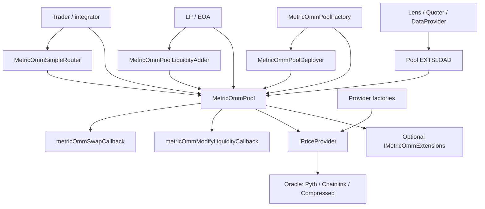

# Metric OMM - structura protocolului

Acest document este o harta de audit pentru protocolul Metric OMM din acest folder. Scopul lui este sa explice ce face protocolul, care sunt modulele principale, care sunt entry point-urile si cum se leaga flow-urile intre ele.

## 1. Ce este protocolul

Metric OMM este un market maker bazat pe oracle, nu un AMM clasic care descopera pretul doar din rezerve. Pool-ul ia un `bid` si un `ask` de la un `IPriceProvider`, calculeaza un mid price si un spread de baza, apoi executa swap-uri printr-o scara de bin-uri de lichiditate configurate la crearea pool-ului.

Ideea centrala:

- pretul de referinta vine din oracle/provider;
- lichiditatea sta in bin-uri, fiecare bin avand lungime, solduri token0/token1 si fee-uri aditionale;
- swap-ul muta cursorul pool-ului prin bin-uri, consuma lichiditate si actualizeaza soldurile bin-urilor;
- LP-ii nu primesc ERC20/ERC721; pozitiile sunt accounting intern pe cheia `(owner, salt, bin)`;
- fee-urile sunt impartite intre protocol si pool admin;
- factory-ul este stratul de policy si registry;
- extensiile optionale pot bloca/valida operatii inainte/dupa add/remove/swap.

## 2. Harta repo-ului

```text
2026-07-metric-miuAvlad/
|-- metric-core/
|   `-- contracts/
|       |-- MetricOmmPool.sol
|       |-- MetricOmmPoolFactory.sol
|       |-- MetricOmmPoolDeployer.sol
|       |-- ExtensionCalling.sol
|       |-- Extsload.sol
|       |-- interfaces/
|       |-- libraries/
|       `-- types/
|-- metric-periphery/
|   `-- contracts/
|       |-- MetricOmmSimpleRouter.sol
|       |-- MetricOmmPoolLiquidityAdder.sol
|       |-- base/
|       |-- common/
|       |-- extensions/
|       |-- lens/
|       |-- libraries/
|       `-- interfaces/
`-- smart-contracts-poc/
    `-- contracts/
        |-- PriceProvider*.sol
        |-- AnchoredPriceProvider.sol
        |-- *ProviderFactory*.sol
        |-- oracles/
        `-- interfaces/
```

### `metric-core`

Core-ul protocolului:

- `MetricOmmPool` - pool-ul propriu-zis: liquidity, swap, simulation, fee accounting, storage compact.
- `MetricOmmPoolFactory` - registry si policy layer: `createPool`, fee caps, admin roles, pause, oracle rotation, fee collection.
- `MetricOmmPoolDeployer` - deployeaza pool-uri prin `new MetricOmmPool{salt: ...}`; doar factory-ul il poate chema.
- `LiquidityLib` - logica pentru `addLiquidity` si `removeLiquidity`, apelata prin library/delegatecall style.
- `SwapMath` - matematica pura pentru pret, pozitii in bin, input/output, fee-uri si miscarea cursorului.
- `PoolStateLibrary` - citeste storage-ul pool-ului prin `EXTSLOAD`; este cuplat strict cu layout-ul din `MetricOmmPool`.
- `ExtensionCalling` + `IMetricOmmExtensions` - mecanismul de hooks.

### `metric-periphery`

Layer de integrare si UX:

- `MetricOmmSimpleRouter` - single-hop si multi-hop swaps, exact input si exact output.
- `MetricOmmPoolLiquidityAdder` - helper pentru EOAs la add liquidity, cu callback care trage tokeni de la user.
- `MetricOmmSwapQuoter` - quote-uri live prin swap revert si quote-uri ipotetice prin `simulateSwapAndRevert`.
- `MetricOmmPoolStateView` / `MetricOmmPoolDataProvider` - citiri off-chain friendly prin `PoolStateLibrary`.
- `PeripheryPayments`, `SelfPermit`, `Multicall` - helpers de plata, WETH/native, permit si batching.
- extensii: allowlist deposit/swap, stop-loss pe valoare oracle, guard pe viteza pretului.

### `smart-contracts-poc`

Layer de oracle si price providers:

- `IPriceProvider` - interfata vazuta de pool: `token0`, `token1`, `getBidAndAskPrice`.
- `PriceProvider`, `PriceProviderL2`, `ProtectedPriceProvider`, `ProtectedPriceProviderL2` - transforma date oracle in bid/ask Q64.64.
- `AnchoredPriceProvider` - provider standard pentru pool-uri publice: citeste un anchor oracle si clipeaza sursa custom in banda de referinta.
- `PriceProviderFactory*`, `AnchoredProviderFactory` - creeaza provider-e si tin owner/updaters/envelopes.
- `PythOracle`, `ChainlinkOracle`, `CompressedOracleV1` - surse de date oracle.

## 3. Diagrama mare



Citirea diagramei:

- `Factory` creeaza si administreaza pool-ul.
- `Pool` executa settlement-ul real.
- `Provider` da pretul curent, iar `Oracle` da datele brute.
- `Router` si `LiquidityAdder` sunt wrappers peste entry point-urile pool-ului.
- `Extensions` sunt hooks optionale chemate de pool.
- `Lens`/`Quoter` citesc sau simuleaza, fara sa detina autoritate asupra pool-ului.

## 4. Modelul de date

### Pool parameters

`PoolParameters` este input-ul pentru `MetricOmmPoolFactory.createPool`:

- `token0`, `token1` - perechea ERC20; trebuie sa corespunda cu provider-ul.
- `priceProvider` - contract care implementeaza `IPriceProvider`.
- `extensions`, `extensionOrders`, `extensionInitData` - hook-uri optionale, maxim 7.
- `priceProviderTimelock` - daca este `type(uint256).max`, provider-ul e immutable; altfel poate fi schimbat dupa timelock.
- `admin`, `adminFeeDestination` - pool admin si destinatia fee-urilor de admin.
- `initialAmount0PerShareE18`, `initialAmount1PerShareE18` - densitatea initiala pentru bin-uri goale.
- `minimalMintableLiquidity` - minimul de shares per pozitie/bin.
- `adminSpreadFeeE6`, `adminNotionalFeeE8` - fee-uri de admin.
- `curBinDistFromProvidedPriceE6` - ancora initiala a scarii de bin-uri fata de pretul oracle.
- `nonNegativeBinDataArray`, `negativeBinDataArray` - bin-urile impachetate.
- `salt` - determinism pentru adresa pool-ului.

### Bin-uri

Fiecare bin are:

- `token0BalanceScaled`
- `token1BalanceScaled`
- `lengthE6`
- `addFeeBuyE6`
- `addFeeSellE6`

Bin packing in `BinDataLibrary`:

```text
48 biti per bin:
bits 0..15   lengthE6
bits 16..31  addFeeBuyE6
bits 32..47  addFeeSellE6

5 bin-uri per uint256
```

Bin-urile non-negative sunt indexate `0, 1, 2, ...`; cele negative sunt `-1, -2, ...`. Factory-ul impune ca grid-ul sa incapa in `int8`.

### Pozitii LP

Pozitiile nu sunt tokenizate. Pool-ul tine:

```text
_binTotalShares[bin]
_positionBinShares[keccak256(abi.encode(owner, salt, int8(bin)))]
```

O pozitie este deci identificata prin:

```text
owner + salt + bin
```

### Slot0

`MetricOmmPool` impacheteaza starea principala in slot 0:

```text
pauseLevel
curBinIdx
curPosInBin
curBinDistFromProvidedPriceE6
spreadFeeE6
notionalFeeE8
```

`PoolStateLibrary` decodeaza exact acest layout prin `EXTSLOAD`. Orice reorder/repack in pool rupe lens-urile si integratorii care citesc prin `PoolStateLibrary`.

## 5. Componentele principale

### `MetricOmmPool`

Pool-ul are entry point-urile user-facing:

- `addLiquidity(owner, salt, deltas, callbackData, extensionData)`
- `removeLiquidity(owner, salt, deltas, extensionData)`
- `swap(recipient, zeroForOne, amountSpecified, priceLimitX64, callbackData, extensionData)`
- `simulateSwapAndRevert(...)`
- `getSellAndBuyPrices()`
- `getImmutables()`
- `inSwap()`

Si entry point-uri privilegiate, apelabile doar de factory:

- `collectFees(...)`
- `setPoolFees(...)`
- `setPause(...)`
- `setBinAdditionalFees(...)`
- `setPriceProvider(...)`

Pool-ul este locul unde se intampla:

- citirea pretului de la provider;
- executia swap-ului prin bin-uri;
- accounting-ul LP pe bin-uri;
- colectarea fee-urilor acumulate;
- transferurile tokenilor in/out;
- chemarea callback-urilor de settlement;
- chemarea extensiilor configurate.

### `MetricOmmPoolFactory`

Factory-ul este registry si policy layer.

Entry point-uri permissionless:

- `createPool(PoolParameters)`
- `collectPoolFees(pool)`

Entry point-uri owner protocol:

- `setPoolDeployer`
- `setFeeCaps`
- `setDefaultSpreadProtocolFeeE6`
- `setDefaultProtocolNotionalFeeE8`
- `setPoolProtocolFee`
- `protocolPausePool`
- `protocolUnpausePool`
- `collectTokens`
- `collectEth`

Entry point-uri pool admin:

- `setPoolAdminFees`
- `setPoolAdminFeeDestination`
- `setPoolBinAdditionalFees`
- `pausePool`
- `unpausePool`
- `proposePoolPriceProvider`
- `executePoolPriceProviderUpdate`
- `proposePoolAdminTransfer`
- `acceptPoolAdmin`
- `cancelPoolAdminTransfer`

Factory-ul tine:

- `poolAdmin[pool]`
- `pendingPoolAdmin[pool]`
- `poolFeeConfig[pool]`
- `poolAdminFeeDestination[pool]`
- `priceProviderTimelock[pool]`
- `pendingPriceProvider[pool]`
- `idxToPool`, `poolToIdx`, `nextPoolIdx`

Pool-ul nu verifica direct `poolAdmin`. Adminii actioneaza prin factory, iar pool-ul accepta privileged calls doar de la factory.

### `MetricOmmPoolDeployer`

Are un singur flow important:

```text
MetricOmmPoolFactory.createPool
  -> MetricOmmPoolDeployer.deploy
    -> new MetricOmmPool{salt: params.salt}(...)
```

Deployer-ul verifica doar `msg.sender == FACTORY`. Validarea parametrilor se face in factory.

### `IPriceProvider` si oracole

Pool-ul stie doar despre interfata:

```solidity
function token0() external view returns (address);
function token1() external view returns (address);
function getBidAndAskPrice() external returns (uint128 bidPrice, uint128 askPrice);
```

Provider-ele:

- citesc date brute din oracle;
- verifica staleness, guard-uri si invariantul `bid < ask`;
- convertesc pretul la Q64.64;
- aplica confidence/spread/margin;
- returneaza bid/ask catre pool.

`AnchoredPriceProvider` adauga o garantie importanta: orice sursa custom este clamp-uita in banda derivata din anchor-ul oracle. In reference mode, quote-ul vine direct din anchor band.

### Extensii

Pool-ul poate avea maxim 7 extensii. `extensionOrders` impacheteaza ordinea de apel pentru:

- `beforeAddLiquidity`
- `afterAddLiquidity`
- `beforeRemoveLiquidity`
- `afterRemoveLiquidity`
- `beforeSwap`
- `afterSwap`

Extensiile shipped in periphery:

- `DepositAllowlistExtension` - blocheaza `addLiquidity` daca owner/depositorul nu este permis.
- `SwapAllowlistExtension` - blocheaza `swap` daca sender-ul nu este permis.
- `OracleValueStopLossExtension` - dupa swap, verifica drawdown-ul valorii per share in bin-uri, raportat la oracle mid si watermarks.
- `PriceVelocityGuardExtension` - inainte de swap, limiteaza viteza de miscare a mid price-ului intre block-uri.

Daca o extensie revine, operatia pool-ului revine.

## 6. Flow: creare provider si pregatire oracle

Pentru un pool real, inainte de `createPool` trebuie sa existe un `IPriceProvider` compatibil cu perechea.

Flow general:

```text
Oracle update path:
  Pyth/Chainlink/Compressed data pushed on-chain
  -> oracle stocheaza price/spread/timestamp
  -> provider citeste oracle cand pool-ul cere bid/ask

Provider creation:
  user/curator -> ProviderFactory.create...
  -> provider este deployat
  -> providerOwner/updates sunt tinute in factory-ul de provider
```

Pentru `PythOracle` si `ChainlinkOracle`, citirea on-chain protejata se face prin:

```text
Pool.swap
  -> pool.inSwap() returneaza provider-ul curent in timpul swap-ului
  -> provider.getBidAndAskPrice()
  -> oracle.price(feedId, pool)
  -> oracle verifica pool.inSwap() == provider
  -> oracle verifica registeredPool[feedId][pool]
```

Pentru `CompressedOracleV1`, read path-ul este mai deschis si price-ul este derivat din feedId-ul care encodeaza namespace/slot/position.

## 7. Flow: `createPool`

```text
Caller
  -> MetricOmmPoolFactory.createPool(params)
    -> valideaza token0/token1
    -> valideaza priceProvider.token0/token1
    -> valideaza admin si fee destination
    -> valideaza fee caps
    -> citeste decimals si calculeaza scale multipliers
    -> despacheteaza si valideaza bin arrays
    -> valideaza extensions + orders + init data
    -> calculeaza total spread/notional fees
    -> MetricOmmPoolDeployer.deploy(...)
      -> new MetricOmmPool{salt}
    -> initializeaza extensiile cu initialize(pool, data)
    -> salveaza admin, fee config, timelock, registry index
    -> emite PoolCreated
```

Conexiuni importante:

- `PoolParameters` este user input.
- `DeployParams` este forma derivata si scalata pentru deployer.
- `MetricOmmPool` primeste multe valori ca immutables.
- Factory-ul pastreaza rolurile si fee split-urile; pool-ul pastreaza doar total fee rates.

## 8. Flow: add liquidity direct

```text
LP contract / integrator
  -> pool.addLiquidity(owner, salt, deltas, callbackData, extensionData)
    -> beforeAddLiquidity extensions
    -> LiquidityLib.addLiquidity
      -> pentru fiecare bin:
        -> verifica range
        -> calculeaza cat token0/token1 trebuie adaugat
        -> updateaza binState, binTotalShares, positionBinShares
      -> updateaza binTotals
      -> converteste scaled amounts la token native units, rounding ceil
      -> callback: msg.sender.metricOmmModifyLiquidityCallback(amount0, amount1, callbackData)
      -> verifica pool balance a crescut suficient
      -> emite LiquidityAdded
    -> afterAddLiquidity extensions
```

Observatii:

- `msg.sender` trebuie sa implementeze `IMetricOmmModifyLiquidityCallback` daca suma de plata este non-zero.
- Plata intra in pool prin callback, nu prin `transferFrom` direct in pool.
- Pentru bin-uri goale, compozitia initiala depinde de pozitia bin-ului fata de cursorul curent.
- Pentru bin-ul curent, compozitia este proportionala cu `curPosInBin`.

## 9. Flow: add liquidity prin `MetricOmmPoolLiquidityAdder`

```text
EOA / LP
  -> LiquidityAdder.addLiquidityExactShares(...)
    -> seteaza pay context transient: pool, payer, max0, max1
    -> pool.addLiquidity(..., callbackData = KIND_PAY)
      -> pool cere plata prin metricOmmModifyLiquidityCallback
      -> LiquidityAdder verifica msg.sender == expectedPool
      -> verifica amount0/amount1 <= max caps
      -> citeste token0/token1 din pool.getImmutables()
      -> transferFrom payer catre pool
    -> curata pay context
```

Pentru `addLiquidityWeighted`, helper-ul face intai un probe care revine intentionat cu `LiquidityProbe(need0, need1)`, scaleaza weights la shares in functie de max token caps, apoi executa add-ul real.

Atentie de audit: `MetricOmmPoolLiquidityAdder` mentioneaza explicit ca nu verifica pool-ul impotriva factory-ului. Caller-ul trebuie sa dea un pool legitim.

## 10. Flow: remove liquidity

```text
LP
  -> pool.removeLiquidity(owner, salt, deltas, extensionData)
    -> verifica msg.sender == owner
    -> beforeRemoveLiquidity extensions
    -> LiquidityLib.removeLiquidity
      -> verifica shares disponibile
      -> scade shares si solduri per bin
      -> updateaza binTotals
      -> converteste scaled amounts la token native units, rounding floor
      -> transfera token0/token1 direct catre owner
      -> emite LiquidityRemoved
    -> afterRemoveLiquidity extensions
```

Pause-ul blocheaza swap-urile, nu remove liquidity. Asta este important pentru invariantul de withdraw al LP-ilor.

## 11. Flow: swap direct pe pool

Parametrii principali:

- `recipient` - primeste output-ul.
- `zeroForOne` - `true` inseamna token0 in, token1 out; `false` inseamna token1 in, token0 out.
- `amountSpecified` - pozitiv pentru exact-in, negativ pentru exact-out.
- `priceLimitX64` - limita de executie.
- `callbackData` - date pentru settlement callback.
- `extensionData` - date opace pentru extensii.

Flow:

```text
Trader contract / router
  -> pool.swap(...)
    -> verifica pauseLevel == 0
    -> incarca packedSlot0Initial
    -> provider.getBidAndAskPrice()
      -> bid/ask trebuie sa fie bid > 0 si bid < ask
    -> beforeSwap extensions
    -> SwapMath.midAndSpreadFeeX64FromBidAsk(bid, ask)
    -> _executeSwap(...)
      -> alege una din cele 4 cai:
        -> token0 -> token1 exact-in
        -> token0 -> token1 exact-out
        -> token1 -> token0 exact-in
        -> token1 -> token0 exact-out
      -> merge prin bin-uri in directia corecta
      -> updateaza curBinIdx, curPosInBin, curBinDist
      -> updateaza binStates si binTotals
      -> acumuleaza protocol/spread/notional fee-uri
    -> transfera output-ul catre recipient
    -> callback: msg.sender.metricOmmSwapCallback(amount0Delta, amount1Delta, callbackData)
    -> verifica input-ul a intrat in pool
    -> afterSwap extensions
    -> emite Swap
```

Semnul delta-urilor:

```text
delta > 0  = trader/caller trebuie sa plateasca tokenul catre pool
delta < 0  = pool trimite tokenul catre recipient
```

Exemple:

```text
zeroForOne = true:
  amount0Delta > 0
  amount1Delta < 0
  trader plateste token0, primeste token1

zeroForOne = false:
  amount1Delta > 0
  amount0Delta < 0
  trader plateste token1, primeste token0
```

## 12. Flow: swap prin router

### Exact input single

```text
User
  -> Router.exactInputSingle(params)
    -> deadline check
    -> normalize priceLimit
    -> verifica factory.isPool(pool)
    -> seteaza callback context transient:
       expectedPool, mode=JUST_PAY, payer=user, tokenIn
    -> pool.swap(recipient, zeroForOne, +amountIn, ...)
      -> pool callback catre router
      -> router verifica msg.sender == expectedPool si factory.isPool(msg.sender)
      -> router transferFrom payer catre pool
    -> router verifica amountOut >= amountOutMinimum
    -> clear callback context
```

### Exact input multihop

```text
User
  -> Router.exactInput(params)
    -> pentru fiecare hop i:
      -> input-ul hopului 0 vine de la user
      -> input-ul hopurilor urmatoare vine din router
      -> output intermediar sta pe router
      -> output final merge la recipient
```

Router-ul nu valideaza complet conectivitatea `tokens[i] <-> pools[i]` in toate entry point-urile; caller-ul trebuie sa construiasca path-ul corect.

### Exact output single

```text
User
  -> Router.exactOutputSingle(params)
    -> pool.swap(..., -amountOut, ...)
    -> router plateste input-ul cerut in callback
    -> verifica output exact si amountIn <= amountInMaximum
```

### Exact output multihop

Flow-ul porneste de la ultimul pool si merge recursiv inapoi in callback:

```text
Router.exactOutput
  -> swap pe ultimul pool pentru output final exact
    -> callback cere input pentru ultimul hop
      -> router face swap pe hopul anterior ca sa obtina exact acel input
        -> callback urmator
          -> ...
            -> primul hop este platit de user
```

## 13. Flow: quoting

### Quote live

`MetricOmmSwapQuoter` cheama `pool.swap`, iar in callback revine cu `QuoteSwapResult(amount0Delta, amount1Delta)`. Quoter-ul decodeaza revert-ul si returneaza amount in/out.

```text
Quoter.quoteLive...
  -> pool.swap(...)
    -> pool ajunge la callback catre quoter
    -> quoter revert QuoteSwapResult(delta0, delta1)
  -> quoter decodeaza revert-ul
```

### Quote ipotetic

`simulateSwapAndRevert` foloseste bid/ask date de caller, nu oracle-ul live.

```text
Quoter.quoteHypothetical...
  -> pool.simulateSwapAndRevert(..., bidPriceX64, askPriceX64, ...)
    -> ruleaza aceeasi logica de swap
    -> revine cu SimulateSwap(delta0, delta1)
  -> quoter decodeaza revert-ul
```

Important: `simulateSwapAndRevert` cheama si extensiile de swap daca sunt configurate, folosind `extensionData` si preturile ipotetice.

## 14. Flow: fee-uri

Exista doua familii de fee:

- spread fee - surplus rezultat din spread/base fee si add fee-uri;
- notional fee - acumulatori `notionalFeeToken0Scaled` si `notionalFeeToken1Scaled`.

Fee config-ul canonic pe componente este in factory:

```text
PoolFeeConfig:
  protocolSpreadFeeE6
  adminSpreadFeeE6
  protocolNotionalFeeE8
  adminNotionalFeeE8
```

Pool-ul stocheaza doar totalurile:

```text
spreadFeeE6 = protocolSpread + adminSpread
notionalFeeE8 = protocolNotional + adminNotional
```

Collect flow:

```text
Anyone
  -> Factory.collectPoolFees(pool)
    -> citeste PoolFeeConfig si adminFeeDestination
    -> pool.collectFees(...)
      -> calculeaza surplus fata de binTotals
      -> imparte spread fee pro-rata intre protocol/admin
      -> imparte notional fee pro-rata intre protocol/admin
      -> transfera admin share catre adminFeeDestination
      -> transfera protocol share catre factory
      -> reseteaza notional fee accumulators
```

Protocol owner poate muta tokenii acumulati pe factory prin `collectTokens` / `collectEth`.

## 15. Flow: management si pause

### Pause levels

```text
0 = activ
1 = paused by pool admin
2 = paused by protocol owner
```

Tranzitii:

- pool admin: `0 -> 1` prin `pausePool`
- pool admin: `1 -> 0` prin `unpausePool`
- protocol owner: `0/1 -> 2` prin `protocolPausePool`
- protocol owner: `2 -> 1` prin `protocolUnpausePool`

Protocol owner nu poate duce direct `2 -> 0`; dupa un protocol pause, pool admin trebuie sa faca explicit unpause final.

### Oracle rotation

Pentru provider mutabil:

```text
Pool admin
  -> Factory.proposePoolPriceProvider(pool, newProvider)
    -> verifica pool nu are immutable provider
    -> verifica newProvider.token0/token1
    -> seteaza pending + executeAfter

Dupa timelock:
  -> Factory.executePoolPriceProviderUpdate(pool)
    -> valideaza din nou
    -> pool.setPriceProvider(newProvider)
```

Daca `priceProviderTimelock == type(uint256).max` la creare, provider-ul devine immutable.

### Admin transfer

```text
current admin -> proposePoolAdminTransfer(pool, newAdmin)
newAdmin      -> acceptPoolAdmin(pool)
current admin -> cancelPoolAdminTransfer(pool)
```

## 16. Flow: extensii

Extensiile sunt chemate din pool in ordinea impachetata in `ExtensionOrders`.

```text
addLiquidity:
  beforeAddLiquidity extensions
  core add liquidity
  afterAddLiquidity extensions

removeLiquidity:
  beforeRemoveLiquidity extensions
  core remove liquidity
  afterRemoveLiquidity extensions

swap:
  beforeSwap extensions
  core swap
  afterSwap extensions
```

Factory-ul valideaza:

- maxim 7 extensii;
- niciun address zero;
- fara duplicate;
- `extensionInitData.length == extensions.length`;
- order-ele sa contina doar indici valizi si fara duplicate;
- daca nu exista extensii, order-ele trebuie sa fie zero.

## 17. Flow: provider/oracle

### Provider generic

```text
Pool.swap
  -> IPriceProvider.getBidAndAskPrice()
    -> provider citeste oracle
    -> verifica staleness
    -> verifica price guard
    -> aplica spread/confidence/margin
    -> returneaza bid/ask Q64.64
```

Pool-ul verifica la randul sau:

```text
bid != 0
bid < ask
```

### Providers oracle protejat

`PythOracle` si `ChainlinkOracle` folosesc `OracleBase` cu read protection:

```text
oracle.price(feedId, pool)
  -> msg.sender trebuie sa fie provider-ul
  -> pool.inSwap() trebuie sa intoarca provider-ul
  -> pool trebuie inregistrat pentru feedId
  -> pool si providerul nu trebuie blacklistati
  -> emite PriceRead(pool, feedId)
```

Pool registration:

```text
oracle.register(feedId, pool, factory)
  -> msg.value >= registrationFee
  -> factory este approved
  -> factory.isPool(pool)
  -> registeredPool[feedId][pool] = true
```

### Anchored provider

`AnchoredPriceProvider` poate lucra in doua moduri:

- reference mode: quoteaza direct banda `mid +/- (spreadBps + minMargin)`;
- source mode: citeste un `IAnchorSource` custom si clipeaza bid/ask-ul in banda de referinta.

Pentru synthetic pairs, poate citi doua feed-uri:

```text
baseFeedId / quoteFeedId
```

Spread-urile relative se aduna.

## 18. Entry point-uri pe actori

### Trader / integrator

Direct pe pool:

- `MetricOmmPool.swap`
- `MetricOmmPool.getSellAndBuyPrices`
- `MetricOmmPool.simulateSwapAndRevert`

Prin router:

- `MetricOmmSimpleRouter.exactInputSingle`
- `MetricOmmSimpleRouter.exactInput`
- `MetricOmmSimpleRouter.exactOutputSingle`
- `MetricOmmSimpleRouter.exactOutput`
- `multicall`
- `selfPermit*`
- `unwrapWETH9`, `sweepToken`, `refundETH`

### LP

Direct pe pool:

- `addLiquidity`
- `removeLiquidity`

Prin helper:

- `MetricOmmPoolLiquidityAdder.addLiquidityExactShares`
- `MetricOmmPoolLiquidityAdder.addLiquidityWeighted`
- `multicall`

### Pool admin

Prin factory:

- `setPoolAdminFees`
- `setPoolAdminFeeDestination`
- `setPoolBinAdditionalFees`
- `pausePool`
- `unpausePool`
- `proposePoolPriceProvider`
- `executePoolPriceProviderUpdate`
- `proposePoolAdminTransfer`
- `acceptPoolAdmin`
- `cancelPoolAdminTransfer`

Prin extensii, daca sunt configurate:

- allowlist deposit/swap setters;
- stop-loss parameter propose/execute/cancel;
- price velocity config.

### Protocol owner

Prin factory:

- `setPoolDeployer`
- `setFeeCaps`
- `setDefaultSpreadProtocolFeeE6`
- `setDefaultProtocolNotionalFeeE8`
- `setPoolProtocolFee`
- `protocolPausePool`
- `protocolUnpausePool`
- `collectTokens`
- `collectEth`

### Keeper / permissionless caller

- `MetricOmmPoolFactory.createPool`
- `MetricOmmPoolFactory.collectPoolFees`
- oracle updates, daca payload-ul/signature-ul este valid;
- `oracle.register` pentru inregistrarea pool-ului pe feed.

### Oracle / provider admin

- `OracleBase.setPriceGuard`
- `OracleBase.setStateGuardRole`, `acceptStateGuardRole`
- `OracleBase.addApprovedFactory`, `removeApprovedFactory`
- `OracleBase.setBlacklist`
- `OracleBase.addIntegrator`, `removeIntegrator`
- `PriceProviderFactory.setConfidence`
- `AnchoredProviderFactory.setEnvelope`, `setFeedClass`, `addOracle`, `createAnchoredProvider`, `setSource`, `setConfidence`

## 19. Cum se leaga modulele intre ele

### Factory -> Pool

Factory-ul:

- creeaza pool-ul;
- tine registry-ul;
- tine adminul si fee split-ul;
- este singurul care poate chema functiile privileged de pe pool.

Pool-ul:

- nu cunoaste pool admin direct;
- are `FACTORY` immutable;
- accepta privileged calls doar prin `onlyFactory`.

### Pool -> PriceProvider -> Oracle

Pool-ul cere un bid/ask:

```text
pool._getBidAndAskPriceX64()
  -> provider.getBidAndAskPrice()
    -> oracle.price/getOracleData
```

Provider-ul trebuie sa raporteze aceleasi token-uri ca pool-ul la creare sau la rotatie.

### Pool -> Extension

Pool-ul cheama extensii prin `CallExtension.callExtension`, iar extensia trebuie sa intoarca selectorul functiei apelate. Ordinea este hardcoded in immutables prin `extensionOrders`.

### Pool -> Callback caller

Pentru settlement:

- `addLiquidity` cheama `metricOmmModifyLiquidityCallback` pe `msg.sender`;
- `swap` cheama `metricOmmSwapCallback` pe `msg.sender`.

De aceea routerul si liquidity adder-ul sunt contracte care implementeaza callback-urile necesare.

### Periphery -> Pool

Router-ul si adder-ul:

- nu detin lichiditate long-term;
- seteaza context transient;
- apeleaza pool-ul;
- raspund la callback si platesc input-ul;
- curata contextul.

### Lens/Quoter -> Pool

Lens-urile citesc prin `PoolStateLibrary` + `Extsload`.

Quoter-ul:

- foloseste revert-based quoting;
- live quote ajunge in `swap` si revine din callback;
- hypothetical quote ajunge in `simulateSwapAndRevert`.

## 20. Zone critice pentru audit

### Storage layout si EXTSLOAD

`PoolStateLibrary` trebuie sa ramana aliniat cu `MetricOmmPool`. Orice schimbare in slot-uri, packing sau mapping base slot rupe:

- `MetricOmmPoolStateView`
- `MetricOmmPoolDataProvider`
- extensii care citesc bin states
- integratori off-chain

### Settlement callback

Pool-ul face transferul output-ului inainte de callback, apoi cere input-ul in callback si verifica balance delta. Zone de urmarit:

- semnele delta-urilor;
- partial fills;
- rounded scaled-to-external conversions;
- tokeni cu comportament non-standard;
- reentrancy guard transient si action ids.

### Oracle path

Protocolul depinde fundamental de provider. Zone de urmarit:

- stale/future timestamp logic;
- `bid < ask` si `bid != 0`;
- price guard min/max;
- oracle registration si `inSwap` binding;
- source clamp in `AnchoredPriceProvider`;
- synthetic ratio si adunarea spread-urilor.

### Bin traversal

Swap-ul se misca:

- in sus prin bin-uri cand user cumpara token0 cu token1;
- in jos prin bin-uri cand user cumpara token1 cu token0.

Zone de urmarit:

- trecerea intre bin-uri goale/ne-goale;
- `curPosInBin == 0` si `curPosInBin == type(uint104).max`;
- `LOWEST_BIN` / `HIGHEST_BIN`;
- price limits;
- fee rounding.

### Fee accounting

Pool-ul stocheaza total fee rates, factory-ul stocheaza split-ul protocol/admin. Zone de urmarit:

- colectarea inainte de schimbare fee;
- split-ul pe surplus si notional fee;
- rounding floor la transfer;
- acumularea dust-ului;
- fee cap clamping.

### Extensii

Extensiile pot bloca operatii si pot citi/depinde de `packedSlot0`, bid/ask si `extensionData`. Zone de urmarit:

- order encoding;
- reverts in before/after hooks;
- trust assumptions pentru pool admin;
- citiri EXTSLOAD;
- efecte in `simulateSwapAndRevert`.

## 21. Rezumat mental rapid

```text
Provider/Oracle da pretul.
Pool-ul executa matematica si settlement-ul.
Factory-ul controleaza deploy, fees, pause, admin si oracle rotation.
Periphery-ul face UX: router, callbacks, quotes, add-liquidity helper.
Extensiile sunt hooks optionale de policy/risk.
Lens-urile citesc storage-ul compact prin EXTSLOAD.
```

Cand urmaresti un bug, intreaba in ordine:

1. Cine este caller-ul real?
2. Intra direct in pool sau prin periphery?
3. Ce callback va fi chemat si cine plateste?
4. Ce provider da pretul si ce guard-uri aplica?
5. Ce extensii ruleaza inainte/dupa?
6. Ce storage se actualizeaza: slot0, bin state, bin totals, shares sau fee accumulators?
7. Ce rotunjire este folosita cand trece din scaled units in token units?


## 22. De unde as incepe auditul

Ordinea buna de audit aici nu este "citeste toate fisierele la rand". Protocolul are bug surface mare in legaturile dintre contracte: pool <-> callback caller, pool <-> provider <-> oracle, factory <-> pool, periphery <-> pool si extensions <-> pool storage. As incepe cu flow-urile care muta fonduri si abia apoi cu lens-uri, views si administrare.

### Ranking rapid pe fisiere

Scorurile sunt subiective, dar utile pentru triere:

- Probabilitate = cat de probabil e sa existe bug-uri subtile in fisier.
- Impact = cat de rau ar fi daca bug-ul exista.
- Prioritate = unde merita inceput auditul.

| Prioritate | Fisier / zona | Probabilitate | Impact | De ce conteaza |
| --- | --- | --- | --- | --- |
| P0 | `metric-core/contracts/MetricOmmPool.sol` | Foarte mare | Foarte mare | Swap execution, transferuri, callbacks, fee accounting, pause, provider reads, cursor/bin mutation. |
| P0 | `metric-core/contracts/libraries/SwapMath.sol` | Foarte mare | Foarte mare | Toata matematica de swap: rounding, price limits, bin position, exact-in/exact-out. |
| P0 | `metric-core/contracts/libraries/LiquidityLib.sol` | Mare | Foarte mare | Add/remove liquidity, shares, scaled amounts, callback settlement, rounding user/pool. |
| P0 | `smart-contracts-poc/contracts/AnchoredPriceProvider.sol` | Mare | Foarte mare | Pretul este trust boundary-ul protocolului; source clamp, stale checks, synthetic ratio, bid/ask invariants. |
| P0 | `smart-contracts-poc/contracts/oracles/providers/OracleBase.sol` | Mare | Foarte mare | Read-access protection: `inSwap` binding, registration, blacklist, approved factories. |
| P1 | `metric-core/contracts/MetricOmmPoolFactory.sol` | Mare | Mare | Pool creation, fee caps, oracle rotation, pause transitions, admin transfer, fee collection policy. |
| P1 | `metric-periphery/contracts/MetricOmmSimpleRouter.sol` | Mare | Mare | Multi-hop exact output recursion, callback context, payer/token correctness, slippage checks. |
| P1 | `metric-periphery/contracts/MetricOmmPoolLiquidityAdder.sol` | Mare | Mare | Pulls user tokens in callback; no factory validation on pool; probe/pay transient context. |
| P1 | `metric-core/contracts/libraries/PoolStateLibrary.sol` | Medie | Mare | EXTSLOAD layout coupling; wrong slot decode breaks lens/extensii/risk controls. |
| P1 | `metric-periphery/contracts/extensions/OracleValueStopLossExtension.sol` | Mare | Mare | Reads pool state after swap; direction-aware blocking; watermarks/decay/timelock logic. |
| P1 | `metric-periphery/contracts/extensions/PriceVelocityGuardExtension.sol` | Medie | Mare | Guard state mutates in `beforeSwap`; block-diff math and first-read behavior. |
| P2 | `smart-contracts-poc/contracts/oracles/compressed/CompressedOracle.sol` | Mare | Medie/Mare | Custom packed oracle, signatures, namespace remapping, stale/monotonic update logic. |
| P2 | `smart-contracts-poc/contracts/oracles/providers/ChainlinkOracle.sol` | Medie | Mare | Report verification/decode/normalization; closed market/stalled marker behavior. |
| P2 | `smart-contracts-poc/contracts/oracles/providers/PythOracle.sol` | Medie | Mare | Lazer payload parsing and storage update path. |
| P2 | `smart-contracts-poc/contracts/PriceProvider.sol` | Medie | Mare | Legacy/simple provider math and stale checks. |
| P2 | `smart-contracts-poc/contracts/PriceProviderL2.sol` | Medie | Mare | Future tolerance si L2 timestamp handling. |
| P2 | `smart-contracts-poc/contracts/ProtectedPriceProvider.sol` | Medie | Mare | Abuse-protected provider path, similar cu standard provider. |
| P2 | `smart-contracts-poc/contracts/PriceProviderFactory*.sol` | Medie | Medie/Mare | Provider ownership/updater permissions, batch confidence updates. |
| P2 | `smart-contracts-poc/contracts/AnchoredProviderFactory.sol` | Medie | Mare | Envelope checks, oracle allowlist, provider recognition predicate. |
| P2 | `metric-core/contracts/libraries/ValidateExtensionsConfig.sol` | Medie | Mare | Bad extension order can skip/duplicate hooks or call unexpected contracts. |
| P3 | `metric-periphery/contracts/lens/*` | Medie | Medie | Quote/data correctness; less direct custody, but can mislead integrators. |
| P3 | `metric-periphery/contracts/base/PeripheryPayments.sol` | Medie | Medie | WETH/native payment edge cases, refunds, sweep behavior. |
| P3 | `metric-core/contracts/MetricOmmPoolDeployer.sol` | Mica | Mare | Simplu, dar salt/deploy assumptions matter. |

## 23. Audit path recomandat

### Pasul 1: pool swap end-to-end

Incepe cu `MetricOmmPool.swap` si urmareste toate cele 4 ramuri:

```text
zeroForOne=true,  amountSpecified > 0  -> token0 exact-in, token1 out
zeroForOne=true,  amountSpecified < 0  -> token0 in, token1 exact-out
zeroForOne=false, amountSpecified > 0  -> token1 exact-in, token0 out
zeroForOne=false, amountSpecified < 0  -> token1 in, token0 exact-out
```

Attack vectors:

- partial fill cand pool-ul nu are destula lichiditate;
- `priceLimitX64` care intoarce `(0, 0)` sau executa mai putin decat caller-ul asteapta;
- output transferat inainte de callback, apoi callback care incearca reentrancy sau nu plateste input-ul;
- `IncorrectDelta` care poate fi pacalit de tokeni fee-on-transfer/rebasing/non-standard;
- rounding din scaled units in external units;
- overflow/underflow logic in `binTotals` si `notionalFeeToken*Scaled`;
- cursor final incorect: `curBinIdx`, `curPosInBin`, `curBinDistFromProvidedPriceE6`;
- bin gol traversat gresit sau skip de lichiditate;
- exact-out care primeste mai putin decat output-ul cerut, mai ales la cap de lichiditate;
- fee-uri aplicate pe tokenul gresit sau in directie gresita.

Fisiere de citit impreuna:

```text
MetricOmmPool.sol
SwapMath.sol
PoolOperation.sol
PoolStorage.sol
Slot0Library.sol
```

### Pasul 2: liquidity accounting

Citeste `LiquidityLib` langa `MetricOmmPool.addLiquidity/removeLiquidity`.

Attack vectors:

- shares mint/burn care lasa dust exploatabil;
- pozitie sub `minimalMintableLiquidity` prin add/remove partial;
- bin gol initializat cu compozitie gresita fata de cursor;
- rounding ceil la add si floor la remove amplificabil prin cicluri;
- callback de add liquidity care plateste mai putin, plateste token gresit sau re-intra;
- `owner/salt/bin` key mismatch intre pool si `PoolStateLibrary`;
- remove liquidity cand pool-ul este paused;
- LP poate retrage disproportionat dupa swap-uri care au miscat cursorul;
- total shares per bin devin inconsistent cu bin balances.

### Pasul 3: pool <-> price provider <-> oracle

Acesta este probabil cel mai important inter-contract attack surface.

Flow critic:

```text
pool.swap
  -> pool.inSwap() returneaza provider-ul curent
  -> provider.getBidAndAskPrice()
  -> oracle.price(feedId, pool)
  -> oracle verifica IPool(pool).inSwap() == msg.sender
```

Attack vectors:

- provider malicious acceptat la `createPool` sau prin oracle rotation;
- provider care returneaza `token0/token1` corect, dar pret corupt;
- stale/future timestamp edge cases;
- `bid == 0`, `bid >= ask`, `ask == max` sentinels;
- `AnchoredPriceProvider` source custom care incearca gas grief, revert, returndata bomb, overflow sau bid/ask inversat;
- source quote clamp-uit gresit: final bid prea mare sau ask prea mic fata de anchor band;
- synthetic ratio cu `quoteFeedId`: divizare, spread compus, stale pe unul din feed-uri;
- oracle registration bypass sau spoof: alt contract cere `price(feed, victimPool)`;
- `pool.inSwap()` disponibil doar in timpul action id `SWAP`;
- pool registered pentru feed gresit;
- blacklist/registration fee/approved factory edge cases;
- confidence/marginStep care strange spread-ul sub banda intentionata.

Fisiere de citit impreuna:

```text
MetricOmmPool.sol
IPriceProvider.sol
AnchoredPriceProvider.sol
OracleBase.sol
PythOracle.sol
ChainlinkOracle.sol
CompressedOracle.sol
PriceProvider*.sol
```

### Pasul 4: factory policy si privilegiile

Citeste `MetricOmmPoolFactory` cu intrebarea: "poate un admin semi-trusted sa treaca peste limite?"

Attack vectors:

- `createPool` accepta parametri care duc la pool insolvent/nefunctional;
- bin arrays valide in factory, dar interpretate diferit in pool;
- scale multipliers pentru tokeni cu decimals neasteptat;
- provider immutable vs mutable gresit setat;
- timelock oracle bypass;
- fee caps depasite prin suma protocol + admin;
- schimbare fee fara colectare corecta a fee-urilor anterioare;
- admin fee destination zero sau schimbata in moment nefavorabil;
- pause transitions incorecte, mai ales `2 -> 1 -> 0`;
- admin transfer blocat sau preluat gresit;
- factory cheama `collectFees` pe un non-pool daca mapping-ul e zero/default.

### Pasul 5: router si callback context

Router-ul este un attack surface clasic pentru confuzii de payer, token si pool.

Attack vectors:

- `tokenIn` dat gresit de caller, routerul plateste tokenul gresit catre pool;
- path `tokens/pools` neconectat sau conectat in directie gresita;
- exact-input multihop unde un hop consuma partial input si urmatorul primeste altceva;
- exact-output recursion in callback: context update gresit sau `tradesLeft` off-by-one;
- callback spoofing de la un pool neasteptat;
- transient storage ramas setat dupa revert sau flow partial;
- native ETH/WETH payment path combinat cu multicall/refund/sweep;
- slippage doar la final pentru multihop, fara per-hop price limits.

Fisiere:

```text
MetricOmmSimpleRouter.sol
MetricOmmSwapRouterBase.sol
TransientCallbackPool.sol
MetricOmmSwapPath.sol
MetricOmmSwapResults.sol
PeripheryPayments.sol
```

### Pasul 6: liquidity adder

`MetricOmmPoolLiquidityAdder` merita separat pentru ca trage tokeni de la user.

Attack vectors:

- malicious pool cere pull pana la max caps;
- caller crede ca pool-ul e valid, dar adder-ul nu verifica `factory.isPool`;
- probe flow revine cu alt selector sau returndata malformat;
- weighted add scaleaza shares la zero sau in favoarea pool-ului;
- cursor bounds verificate inainte de probe, dar cursorul se schimba pana la add real;
- pay context transient collision/reentrancy.

### Pasul 7: extensii

Extensiile nu tin tot protocolul, dar pot fi diferenta dintre "safe pool" si "pool bypassabil".

Attack vectors:

- extension order gresit: hook-ul de allowlist/guard nu ruleaza;
- extensie neimplementata dar inclusa in order;
- `msg.sender` in extensie este pool-ul, nu user-ul;
- `DepositAllowlistExtension` verifica owner, nu neaparat payer;
- `SwapAllowlistExtension` verifica sender, dar router poate fi sender in loc de user;
- `OracleValueStopLossExtension` citeste bin states pentru intervalul dintre slot0 initial/final; edge cases la crossing multe bin-uri;
- watermarks initiale zero sau decay prea agresiv;
- `PriceVelocityGuardExtension` updateaza last price inainte sa verifice si apoi revert-ul trebuie sa anuleze state-ul;
- extensii rulate si in `simulateSwapAndRevert`, cu efecte care trebuie revertate.

### Pasul 8: EXTSLOAD si lens-uri

Nu e primul loc pentru loss of funds direct, dar poate ascunde bug-uri de integrare si extensii.

Attack vectors:

- slot constants gresite in `PoolStateLibrary`;
- signed `int8` bin key encoding diferit de mapping-ul `int256`;
- `positionBinKey` diferit intre `LiquidityLib` si `PoolStateLibrary`;
- lens/quoter citeste mutable provider gresit cand provider-ul e immutable;
- data provider foloseste fee config din factory care poate diferi de slot0 total fee.

## 24. Attack vectors intre contracte

### 1. Callback settlement mismatch

```text
Pool -> caller.metricOmmSwapCallback / metricOmmModifyLiquidityCallback
```

Ce cauti:

- pool-ul transfera output inainte sa primeasca input;
- callback-ul poate apela alte contracte Metric;
- balance delta check functioneaza pentru tokeni standard, dar USDT/USDC si edge ERC20 trebuie gandite;
- caller poate fi router, adder, quoter sau contract custom.

### 2. Oracle attribution spoof

```text
Provider -> OracleBase.price(feedId, pool)
OracleBase -> IPool(pool).inSwap()
```

Ce cauti:

- poate cineva citi pret atribuit altui pool?
- poate provider-ul chema oracle cu un pool care nu il foloseste?
- poate pool-ul returna `inSwap()` pentru provider gresit?
- ce se intampla daca provider-ul este rotit in timpul/pana la swap?

### 3. Extension trust boundary

```text
Pool -> Extension
Extension -> Factory.isPool / poolAdmin / PoolStateLibrary
```

Ce cauti:

- extensia presupune ca `msg.sender` este pool legitim;
- extensia se bazeaza pe factory corect;
- extensia citeste storage prin slot-uri corecte;
- extensia poate bloca withdraw-uri sau doar swaps/deposits;
- extensia poate fi initializata de doua ori sau pentru pool gresit.

### 4. Factory split vs pool total fees

```text
Factory.poolFeeConfig[pool] <-> Pool.spreadFeeE6/notionalFeeE8
```

Ce cauti:

- totalul din pool ramane sincron cu componentele din factory;
- colectarea foloseste componentele vechi inainte de update;
- clamping-ul admin fee-urilor nu creeaza mismatch;
- `collectPoolFees` pe pool invalid sau neinitializat.

### 5. Router token/path assumptions

```text
Router params -> Pool immutables -> callback payment token
```

Ce cauti:

- router-ul nu confirma mereu ca `tokenIn` este token0/token1 al pool-ului;
- path connectivity poate fi caller responsibility;
- multihop poate lasa tokeni intermediari blocati sau sweep-uibili;
- exact-output recursion poate plati input-ul catre pool gresit daca transient context e gresit.

### 6. Provider factory recognition vs core permissionlessness

```text
ProviderFactory.isProvider(provider) != MetricOmmPoolFactory.createPool requirement
```

Core factory-ul cere doar `IPriceProvider` compatibil cu tokenii, nu neaparat provider recunoscut de o factory oficiala. Asta inseamna:

- pool creation este permissionless cu orice provider;
- curation-ul provider-elor oficiale este in afara core-ului;
- pentru public pools, verifica daca documentatia/UI/registry impune `AnchoredProviderFactory.isProvider`;
- bug-urile pot aparea cand periphery/lens presupune provider "oficial", dar core-ul accepta orice.

## 25. Heuristici de hunting

Cele mai promitatoare clase de bug aici:

- mismatch intre valoarea calculata in scaled units si transferul efectiv in token units;
- partial fill interpretat ca full fill de router/integrator;
- oracle/provider care fail-open in loc de fail-closed;
- stale/closed market marker care ajunge pret valid;
- callback reentrancy prin alt action id;
- extension care verifica `sender` gresit in prezenta routerului;
- fee split care se desincronizeaza intre factory si pool;
- bin traversal off-by-one la `LOWEST_BIN`, `HIGHEST_BIN`, `curPosInBin == 0`, `curPosInBin == max`;
- signed integer key/slot mismatch in EXTSLOAD;
- admin semi-trusted care poate bypassa timelock/caps;
- source custom din anchored provider care incearca sa consume gaz sau sa intoarca returndata ciudat;
- exact-output multihop care plateste mai mult decat `amountInMaximum` in cazuri de callback nested.

O strategie eficienta:

1. Scrie invariants mentale pentru `binTotals <= balances scaled`, `position shares <= bin total shares`, `bid < ask`, `withdraw works while paused`.
2. Gaseste fiecare loc unde invariantul este temporar incalcat in mijlocul flow-ului.
3. Uita-te ce apel extern exista intre incalcare si restaurare.
4. Verifica daca revert-ul chiar anuleaza tot ce trebuie, inclusiv transient storage si extensii.
5. Compara direct path-ul pool cu path-ul router/periphery pentru diferente de validare.


## 26. Focus audit: Pyth si oracle-level bugs

### Flow-ul Pyth relevant pentru audit

`PythOracle` este un oracle push-based peste Pyth Lazer:

```text
Pusher / keeper
  -> PythOracle.fallback([feedsLength][feedIds][priceUpdate])
    -> LazerConsumer._verifyPayload(...)
      -> pythLazer.verifyUpdate{value: 1 wei}(priceUpdate)
      -> verifica feed ids, proprietati asteptate, timestamp signed
      -> normalizeaza price la 8 decimals si spread bps
    -> LazerConsumer._verifyAndStore(...)
      -> respinge update-uri prea in viitor
      -> scrie doar daca timestamp-ul feed-ului este mai nou

Pool swap / price read
  -> provider.getBidAndAskPrice()
  -> OracleBase.price(feedId, pool)
    -> verifica pool.inSwap() == provider
    -> verifica pool nu este blacklisted
    -> verifica registeredPool[feedId][pool]
    -> intoarce raw oracle data catre provider
```

Observatie: Pyth nu este citit direct de pool. Atacul trebuie sa treaca prin una dintre aceste granite: update signed Pyth, parser/normalizare, storage monotonic, `OracleBase.price`, provider guard.

### Candidate findings / zone cu risc

#### Medium / design risk: `register` poate sterge blacklist-ul pool-ului permissionless

In `OracleBase.register`, orice caller care plateste `registrationFee` poate seta `registeredPool[feedId][pool] = true`. Daca `pool` era blacklisted, acelasi call face si `blacklisted[pool] = false`.

Impact posibil:

- daca blacklist-ul este folosit ca emergency stop pentru un pool compromis, orice actor poate re-activa citirea oracle pentru acel pool atat timp cat `factory.isPool(pool)` inca intoarce true;
- atacul nu cere control pe admin/oracle, doar plata fee-ului si un pool recunoscut de o fabrica aprobata;
- afecteaza toate oracolele care mostenesc acest `OracleBase`, inclusiv `PythOracle`.

Mitigare:

- nu sterge blacklist-ul in `register`;
- sau cere rol admin separat pentru unblacklist;
- sau separa explicit paid redemption de blacklist-ul de securitate, daca acesta este design intentionat.

#### Low / hardening: `PythOracle.fallback` nu verifica bounds pentru `feedsLength`

Calldata este parsata ca `[feedsLength:uint16][feedIds:uint32[]][priceUpdate]`. Contractul calculeaza `priceUpdateOffset = 2 + feedsLength * 4` si seteaza `priceUpdate.length = end - priceUpdateOffset` in assembly.

Daca `feedsLength` este mai mare decat permite calldata, `end - priceUpdateOffset` underflow-eaza la nivel assembly. Cel mai probabil efectul este revert/OOG pe input malformat, nu pierdere de fonduri, fiindca attacker-ul isi face revert pe propriul push.

Mitigare:

- `require(calldatasize() >= 2 + feedsLength * 4)`;
- optional cap pe `feedsLength` pentru a limita gas pe batch-uri neobisnuit de mari.

#### Low / config risk: `expectedProperties` permite duplicate

`LazerConsumer` seteaza `EXPECTED_PROPS_COUNT = expectedProperties.length`, dar `EXPECTED_MASK` de-duplica implicit proprietatile. Daca deployer-ul trece duplicate, schema devine inconsistenta: parserul cere un numar de proprietati egal cu lungimea array-ului, dar masca semantica poate reprezenta mai putine proprietati unice.

Impact:

- mai degraba misconfiguration / deployment footgun decat exploit extern;
- poate face feed-urile imposibil de updatat sau poate forta payload-uri cu proprietati duplicate;
- critic pentru Pyth, fiindca `FeedUpdateTimestamp` este ancora de freshness.

Mitigare:

- reject duplicates in constructor;
- seteaza `EXPECTED_PROPS_COUNT` din popcount-ul mastii, nu din input length;
- teste negative pentru duplicate si proprietati suportate dar ignorate semantic.

#### Low / liveness: un update Pyth invalid mai nou poate bloca feed-ul pana la urmatorul update valid

Daca payload-ul signed are price <= 0 sau timestamp absent, parserul marcheaza intrarea ca invalid/stalled (`price = 0`, spread sentinel). Daca timestamp-ul este mai nou decat cel stocat, intrarea invalida suprascrie pretul vechi.

Provider-ele par sa fail-closed (`FeedStalled`) cand vad `price == 0` sau spread invalid, deci nu este direct un price-manipulation bug. Dar este un vector de liveness: un update invalid semnat poate opri swap-urile dependente de acel feed pana apare un update valid mai nou.

Mitigare:

- monitorizare pentru sentinel/stalled writes;
- decizie explicita daca un invalid update trebuie sa suprascrie ultimul pret valid sau doar sa blocheze citirea printr-un flag separat;
- alerte pentru feed-uri care intra in fail-closed.

#### Info / operational: `verifyUpdate` foloseste fee fix de `1 wei`

`LazerConsumer` apeleaza Pyth Lazer cu `verifyUpdate{value: 1 wei}`. Daca fee-ul real se schimba, daca deploy-ul nu are ETH suficient sau daca admin-ul retrage ETH inainte de push-uri, update-urile Pyth pot incepe sa revina.

Nu pare bug de fonduri, dar este risc operational pentru liveness.

#### Info / integration: `priceGuard` nu este aplicat in `OracleBase.price`

`OracleBase._readPrice` intoarce raw oracle data. Guard-urile de pret sunt aplicate in provider-ele de pret, nu in oracle base. Pentru pool-uri asta pare intentional, fiindca flow-ul corect este `Pool -> Provider -> Oracle`.

Atentie pentru integratori: `integratorPrice` poate primi raw data fara guard-ul provider-ului. Daca un integrator presupune ca citirea este deja clamp-uita/guarded, poate consuma preturi in afara benzii asteptate.

### Ce nu am gasit ca bug high-confidence in Pyth path

- Nu am vazut un bypass direct al `pythLazer.verifyUpdate`; feedId-ul cerut de caller este verificat contra feedId-ului semnat.
- Replay-ul cu date vechi este blocat de monotonicitatea timestamp-ului per feed.
- Future timestamp-ul este limitat de `MAX_TIME_DRIFT`.
- Preturile invalide par sa fail-closed prin provider, nu fail-open ca pret utilizabil.

### Unde as continua hunting-ul pe Pyth

1. Fuzz pe `PythOracle.fallback` cu calldata malformat: `feedsLength` mare, slice gol, feedIds partiale, batch-uri cu duplicate.
2. Tests pentru `expectedProperties` duplicate si proprietati extra ignorate semantic.
3. PoC pentru `register` care re-activeaza un pool blacklisted, apoi citeste prin provider in timpul `pool.inSwap()`.
4. Simulare liveness: pret valid -> update invalid mai nou -> swap revert `FeedStalled` -> update valid mai nou -> swap revine.
5. Test cu `PYTH_VERIFICATION_FEE` insuficient / contract fara ETH pentru a confirma failure mode-ul operational.
